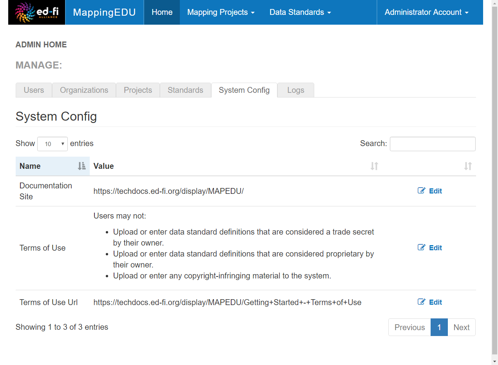

# Admin Feature List

Administrators can do the following tasks in MappingEDU, most of which are
accessed from the Admin Settings page. This is just a brief list to give the new
administrator an idea of what kind of control and configuration are available.

## Feature List

Many features are self-explanatory – but the less obvious features have links to
more detail.

* Administer Guest Login Access ([detail](Administer_Guest_Login_Access.md))
* Edit On-screen Text (limited to a few select phrases, e.g., the summary Terms
  of Use)
* Make Projects and Standards Public
* Manage External Links (e.g., to the Documentation Site and the Terms  of Use)
* Manage Users ([detail](Manage_Users.md))
* Manage Organizations  ([detail](Manage_Organizations.md))
* View All Data Standards
* View All Mapping Projects
* View Swagger API Documentation ([detail](MappingEDU_Swagger_API_Docs.md))
* View System Logs ([detail](System_Logging_in_MappingEDU.md))

## Admin Screen

Where the magic happens:

## Admin Guide Contents

Find out more about how to administer MappingEDU responsibly:

* [Admin Feature List](Admin_Feature_List.md)
* [Administer Guest Login Access](Administer_Guest_Login_Access.md)
* [Manage Users](Manage_Users.md)
* [Manage Organizations](Manage_Organizations.md)
* [MappingEDU Swagger API Docs](MappingEDU_Swagger_API_Docs.md)
* [System Logging in MappingEDU](System_Logging_in_MappingEDU.md)
