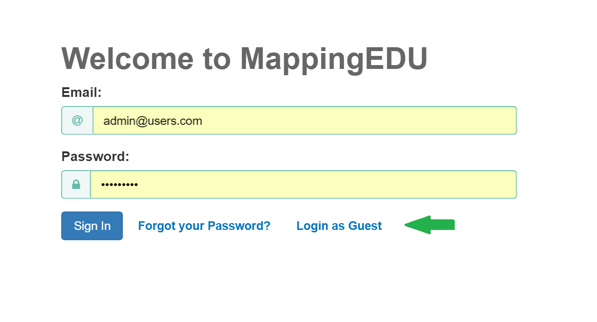
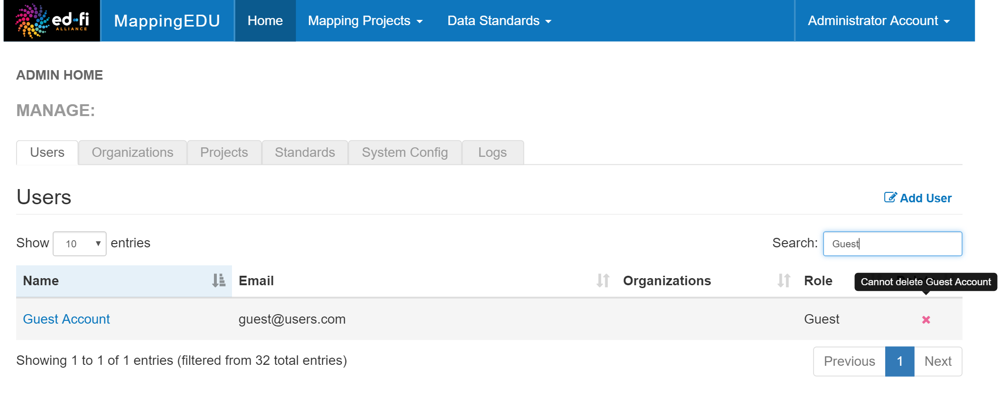
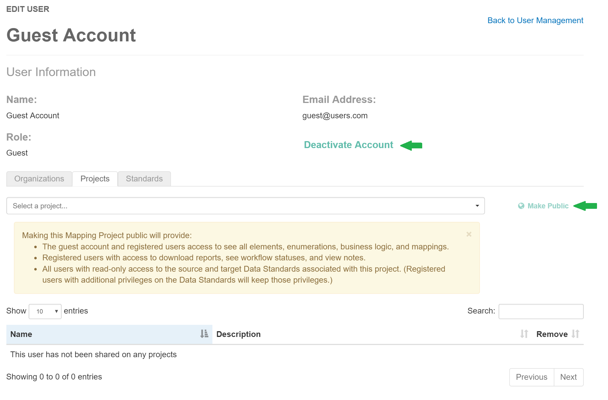

# Administer Guest Login Access

Visitors to MappingEDU who do not have an account established can access
a trimmed down version of the app through use of the Guest Account
Login. Standards and Projects which have been made Public will be
available in view-only mode. Additionally, reports, workflow statuses,
and notes are hidden from anyone logged in with the Guest Account.

MappingEDU administrators can choose to enable or disable Guest login
for the site.

## Logging in as Guest

Logging in as Guest is easy. If the site is currently configured to
allow guest access, a "Login as Guest" link will appear below the
credential fields on the home page:

## Managing the Guest Account

The Guest Account is available under the Users tab.

## Deactivating the Guest Account

The Guest Account cannot be deleted from the system, but it can be
deactivated, if desired. Deactivating the account removes the "Login As
Guest" option from the Login Screen.

To deactivate the Guest Account click the Deactivate Account button on
the Guest Account's User Information page.

### Enabling Guest Account Projects and Standards

Projects and Standards which have been made public are available to the
Guest user. An admin can make a project public from the Guest Account's
User Information page by selecting the standard or project and clicking
the "Make Public" button, as displayed above.

## Admin Guide Contents

Find out more about how to administer MappingEDU responsibly:

* [Admin Feature List](Admin_Feature_List.md)
* [Administer Guest Login Access](Administer_Guest_Login_Access.md)
* [Manage Users](Manage_Users.md)
* [Manage Organizations](Manage_Organizations.md)
* [MappingEDU Swagger API Docs](MappingEDU_Swagger_API_Docs.md)
* [System Logging in MappingEDU](System_Logging_in_MappingEDU.md)