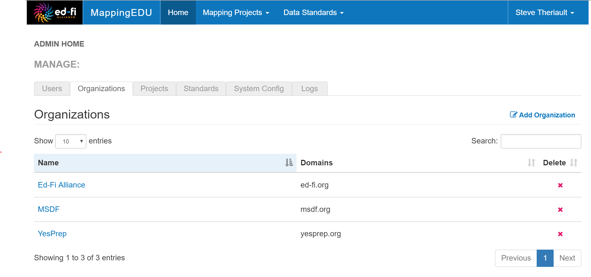

# Manage Organizations

The Organizations tab on the Admin Screen allows the creation of
Organizations (e.g., companies, standards bodies, SEAs, LEAs) that can
be associated with Users. As of the v1.0 release, the feature is simply
an information-only aid for administrators (e.g., to group e-mails from
different domains that have access to the system from the same license).

This lays the groundwork for a feature that provides admins and users
the ability to bulk share standards or project to groups of users based
on their organization.

## Admin Guide Contents

Find out more about how to administer MappingEDU responsibly:

* [Admin Feature List](Admin_Feature_List.md)
* [Administer Guest Login Access](Administer_Guest_Login_Access.md)
* [Manage Users](Manage_Users.md)
* [Manage Organizations](Manage_Organizations.md)
* [MappingEDU Swagger API Docs](MappingEDU_Swagger_API_Docs.md)
* [System Logging in MappingEDU](System_Logging_in_MappingEDU.md)