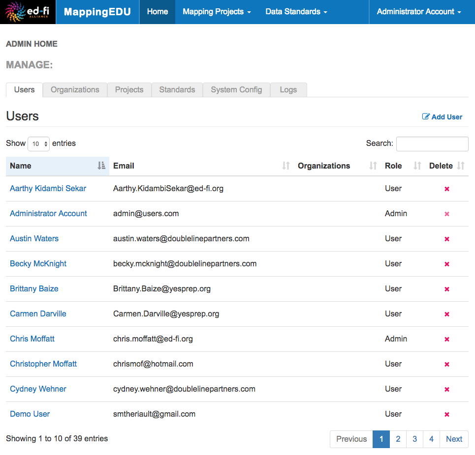
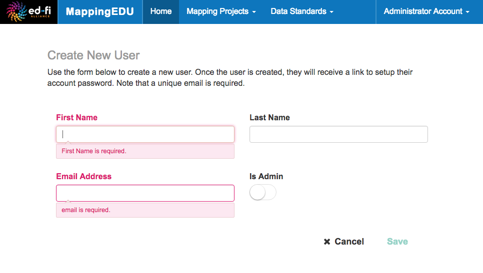

# Manage Users

Basic user management in MappingEDU is easy: simply log in with an
account that has Administrator access. This section outlines a few key
points and answers some common questions.

## Adding Users

Visit **Admin Settings** \> **Users,** and click **Add User.**

Some basic on-screen instructions will appear letting you know what will
happen:

Note that assigning a MappingEDU User to an
[Organization](Manage_Organizations.md) is totally optional. If you're
reading this, we'll bet you can guess what "Is Admin" does.

## Editing Users

Visit **Admin Settings** \> **Users,** and click on a user's name. You
can edit any of the values. Click **Save** when you're done.

Note that if a user changes an organization, their e-mail address will
typically change – and often, an e-mail change indicates that a user is
changing organizations. You can simply edit their e-mail address here.

Note that, technically, the user will still have access to all Mapping
Projects and Data Standards to which they already have permissions. If
you question whether this is inappropriate (or know for sure that it's
not), consider deleting their old account and adding a new one. This
will revoke all permissions – but the user can always get access granted
again by the owner of the project. Alternately, consider contacting the
Project or Standard owner to discuss, if that's an option.

### TIP

Administrators should be aware that the User Management features in
MappingEDU are basic for a reason: we will eventually integrate with SSO
or Google ID or similar, so we intentionally didn't spend much time on
this facet of the system.

## Admin Guide Contents

Find out more about how to administer MappingEDU responsibly:

* [Admin Feature List](Admin_Feature_List.md)
* [Administer Guest Login Access](Administer_Guest_Login_Access.md)
* [Manage Users](Manage_Users.md)
* [Manage Organizations](Manage_Organizations.md)
* [MappingEDU Swagger API Docs](MappingEDU_Swagger_API_Docs.md)
* [System Logging in MappingEDU](System_Logging_in_MappingEDU.md)
