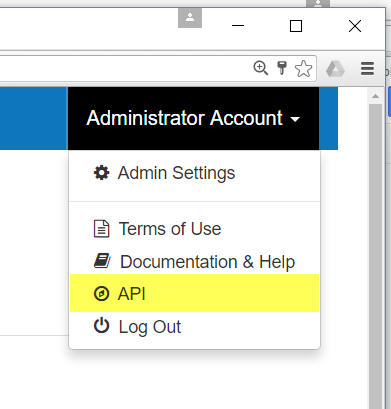
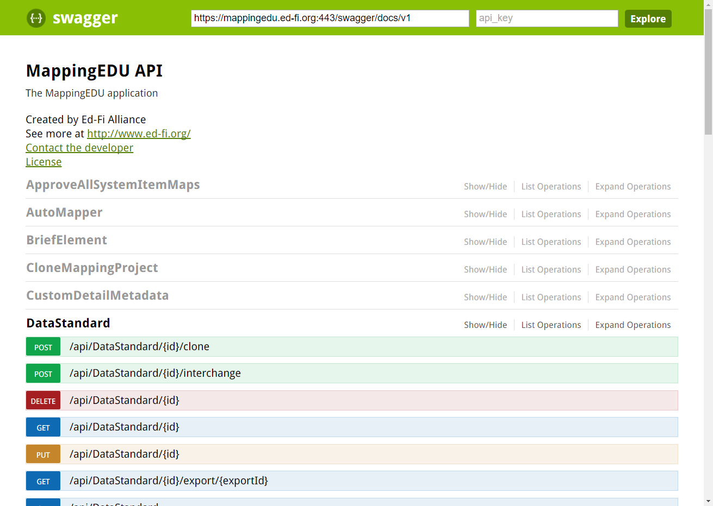

# MappingEDU Swagger API Docs

Logged in users in the Admin role have access to Swagger API
documentation. This section provides a quick overview.

## Background

MappingEDU was not designed with an API in mind – that is, neither the
Alliance nor the developers envisioned API access from other
applications, at least in Version 1.0. However, the architecture lent
itself to including the Swagger UI documentation at minimal extra
cost/overhead – and it was useful in development.

The documentation has also been published to administrators as a way to
get a handle on key system operations, how the data is organized in the
system, etc.

## Accessing the API Docs

Log in to MappingEDU, then select the **User Menu** \> **API**.

If you don't see the API menu, the credentials you used are not in the
Admin role. See an Admin if you think this is in error.

## Swagger Docs

The documentation is in classic Swagger UI format. The system itself has
the current link, so log in as an Admin and check it out.

## Admin Guide Contents

Find out more about how to administer MappingEDU responsibly:

* [Admin Feature List](Admin_Feature_List.md)
* [Administer Guest Login Access](Administer_Guest_Login_Access.md)
* [Manage Users](Manage_Users.md)
* [Manage Organizations](Manage_Organizations.md)
* [MappingEDU Swagger API Docs](MappingEDU_Swagger_API_Docs.md)
* [System Logging in MappingEDU](System_Logging_in_MappingEDU.md)
