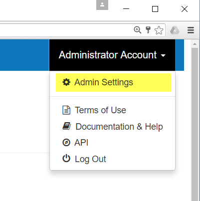

# Administrator Guide

This documentation should not contain passwords or other credentials. It
assumes that the reader has been granted the admin role in the
MappingEDU system.

This is the MappingEDU Administrator Guide. This documentation is
restricted to users who might plausibly need to administer or configure
the MappingEDU application.

## Accessing the Admin Features

As an administrator, most of the features you want to see are in the
Admin Settings screen. If your login has the Admin role, you should see
an "Admin Settings" menu item when you select the account menu:

If you don't see that menu, tough turnips. You may not be an
Administrator. However, any admin can give you Admin access, so ping
someone at the Alliance or on the tech maintenance team for access.

# Admin Guide Contents

Find out more about how to administer MappingEDU responsibly:

* [Admin Feature List](Admin_Feature_List.md)
* [Administer Guest Login Access](Administer_Guest_Login_Access.md)
* [Manage Users](Manage_Users.md)
* [Manage Organizations](Manage_Organizations.md)
* [MappingEDU Swagger API Docs](MappingEDU_Swagger_API_Docs.md)
* [System Logging in MappingEDU](System_Logging_in_MappingEDU.md)
