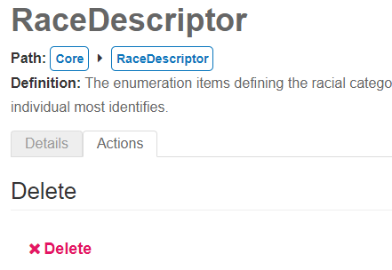

# 1.10 - Map an Enumeration

## Problem

An element has an associated enumeration option set that must be mapped.

## Solution

Map the enumeration set using MappingEDU.

## Discussion

Note that on occasion we receive reports that the values of an enumeration do
not appear in the interface to be mapped. This results when there is another
element (a non-enumeration) that has the same name as the MappingEdu
enumeration. The solution is to delete or rename that other element - see the
section below: _Empty Enumerations Issue._ Some source standard elements have
related enumeration option sets that may correspond with enumeration option sets
of the target data standard. Enumeration sets may be shared across multiple
source standard elements (for example, a student's telephone type and a parent's
telephone type may share the same enumeration set). For this reason, enumeration
sets are mapped separately from their corresponding elements, requiring shared
option sets to only be mapped once per element group, even if they are
referenced in multiple places in the source standard.

Locate the enumeration set to be mapped in the mapping project queue.
Note that filtering by **Item Type** allows you to quickly isolate
enumeration sets.

Select **Enter Mapping Business Logic** in the **Mapping Method**
drop-down menu.

Enter the target standard enumeration that corresponds with the source
standard enumeration.

Allow the Mapping Helper to suggest matches by clicking **Run Mapping
Helper.**

Click **Add** to add the suggested matches.

To manually map an enumeration value, click the plus sign icon in the
**Edit** column beside the value to be mapped.

Select the appropriate target standard enumeration value from the
**Mapping Logic** drop-down menu.

The **Mapping Status** and **Status Reason** drop-down menus allow you
to provide additional detail about the mapping for each enumeration
value. Once the value has been mapped, click **Save.**

Enumeration sets that correspond only with elements that are marked for
extension or omission may similarly be marked for extension or omission
to be consistent with the underlying elements. 

Once the mapping is complete, update the workflow status to indicate
completion.

## Empty Enumerations Issue

This issue occurs when there is an **element** named identically to the
**enumeration** the user is attempting to map values to. (As the
convention is for enumerations to have the suffix "Descriptor" in Ed-Fi,
there should not be any reason to duplicate entity names in this
fashion).

### Why does this occur?

What happens is that the user interface does not display any
enumerations to map to when the mapping logic is being supplied. What is
happening technically is that MappingEdu is looking for enumeration
values on the non-enumeration element, and those  of course do not
exist.

We have traced some instanced of this problem back to an issue with
those who
use [MetaEd](https://techdocs.ed-fi.org/display/EDFIODS/MetaEd) to
generate a MappingEDU import file.

### To fix the problem

To fix the problem, you need to delete or rename the conflicting
**element**, eliminating the duplication of the **enumeration's**
name.** **In most cases, users will delete this element as is was
generally created accidentally.

To see an example below:

In this case, there is **both** an **enumeration** and an **element**
named "RaceDescriptor." When this happens, an attempt to map an
enumeration's values to the enumeration values in RaceDescriptor may
result in an error when trying to populate the mapping logic.

To solve this issue, we will delete the element RaceDescriptor (flagged
with the "1" in the image above).

To do this, we first need to remove the fields that are part of the
element RaceDescriptor.  Click on the element name and use the delete
buttons (the "X") that appear at the right (see the #1, #2 and #3 in the
image above).

Once all fields have been removed from the element, we can delete the
element RaceDescriptor itself, as shown in the image above.

This will solve the issue and allow the enumeration values to appear in
the mapping logic.

## Cookbook Contents

Find out what you can cook with MappingEDU:

* [1.1 - Format a Source Standard for Upload](1.1_-_Format_a_Source_Standard_for_Upload.md)
* [1.2 - Upload a Source Standard](1.2_-_Upload_a_Source_Standard.md)
* [1.3 - Create a Mapping Project](1.3_-_Create_a_Mapping_Project.md)
* [1.4 - Use the Mapping Helper](1.4_-_Use_the_Mapping_Helper.md)
* [1.5 - Filter Lists](1.5_-_Filter_Lists.md)
* [1.6 - Map an Element](1.6_-_Map_an_Element.md)
* [1.7 - Map an Element Using Matchmaker](1.7_-_Map_an_Element_Using_Matchmaker.md)
* [1.8 - Mark an Element for Extension / Omission](1.8_-_Mark_an_Element_for_Extension_Omission.md)
* [1.9 - Use Templates to Create Shortcuts](1.9_-_Use_Templates_to_Create_Shortcuts.md)
* [1.10 - Map an Enumeration](1.10_-_Map_an_Enumeration.md)
* [1.11 - Update Multiple Elements Simultaneously](1.11_-_Update_Multiple_Elements_Simultaneously.md)
* [1.12 - Export into Excel](1.12_-_Export_into_Excel.md)
* [1.13 - Collaborate with Other Users](1.13_-_Collaborate_with_Other_Users.md)
* [1.14 - Upload Ed-Fi ODS / API Endpoints](1.14_-_Upload_Ed-Fi_ODS_API_Endpoints.md)
* [1.15 - Review Common Extensions](1.15_-_Review_Common_Extensions.md)
