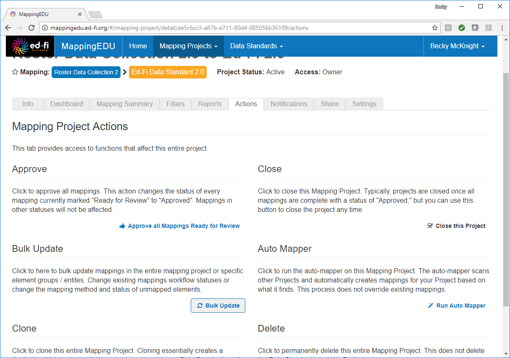
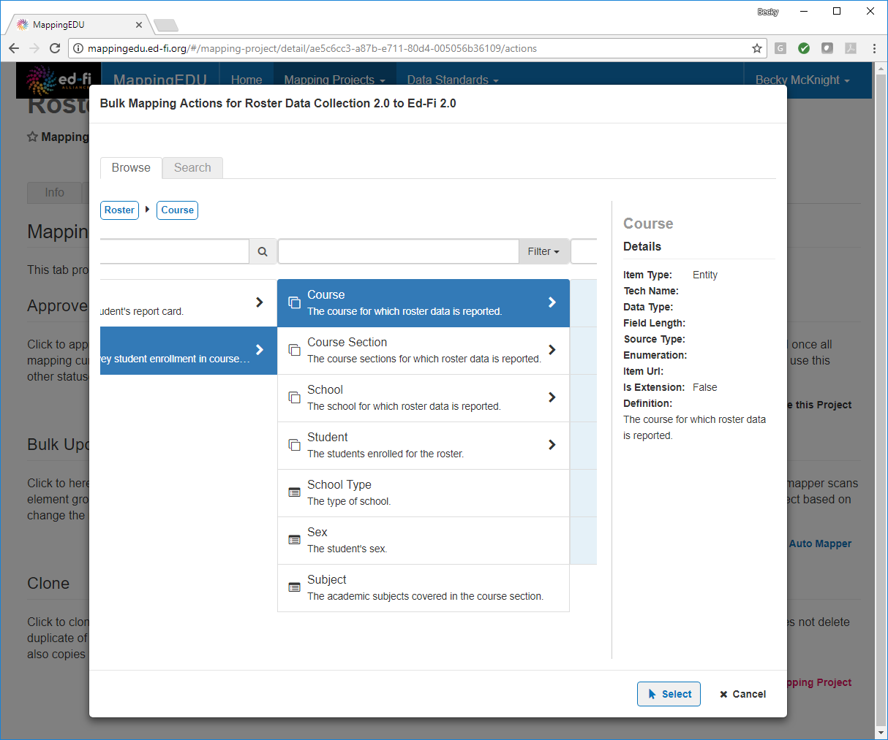
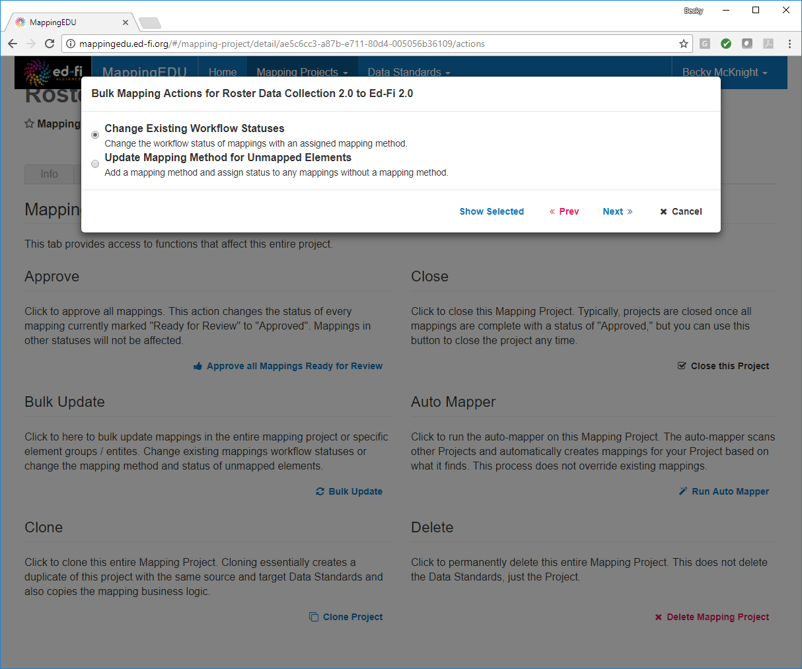
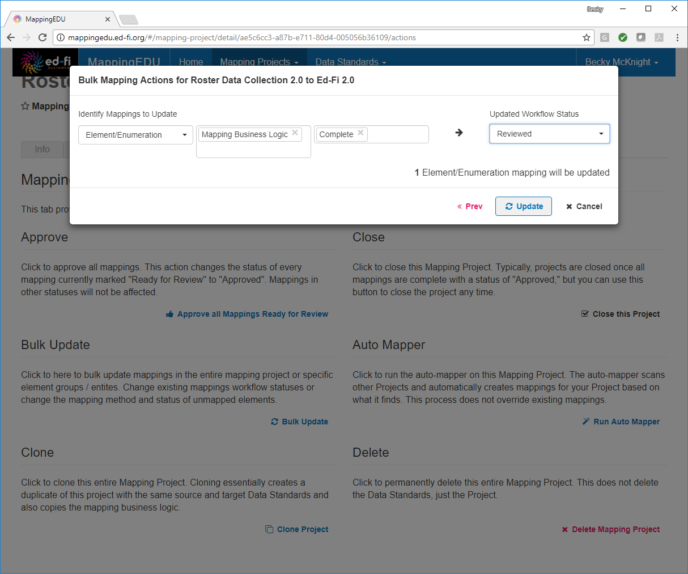
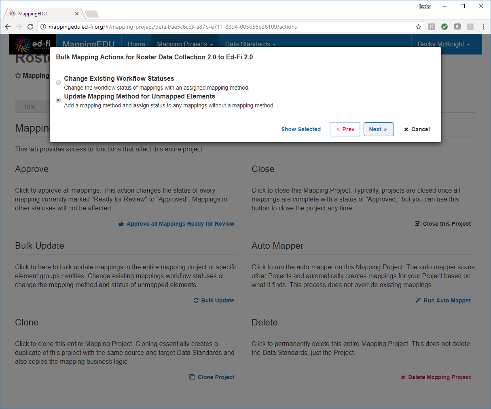

# 1.11 - Update Multiple Elements Simultaneously

## Problem

A set of elements all share the same mapping and/or status and do not
require individual attention.

## Solution

Use the bulk update feature to update multiple elements at once.

## Discussion

Not all elements require individual attention. The bulk update feature
allows you to address multiple elements at one time.

From the **Actions** tab of a mapping project, select **Bulk Update.**

Select the elements to be updated.

To update only the status, choose **Change Existing Workflow Statuses**
and click **Next.**

Specify the conditions under which this update should apply (e.g., only
for mapped elements or enumerations that are marked as complete), choose
the new status, and click **Update.**

To update the mapping method and status for a group of elements or
enumerations, select **Update Mapping Method for Unmapped Elements** and
click **Next.**

Specify the conditions under which the update applies (e.g., elements
and enumerations) and the new mapping method and update status. Provide
any relevant notes and click **Update.**

## Cookbook Contents

Find out what you can cook with MappingEDU:

* [1.1 - Format a Source Standard for Upload](1.1_-_Format_a_Source_Standard_for_Upload.md)
* [1.2 - Upload a Source Standard](1.2_-_Upload_a_Source_Standard.md)
* [1.3 - Create a Mapping Project](1.3_-_Create_a_Mapping_Project.md)
* [1.4 - Use the Mapping Helper](1.4_-_Use_the_Mapping_Helper.md)
* [1.5 - Filter Lists](1.5_-_Filter_Lists.md)
* [1.6 - Map an Element](1.6_-_Map_an_Element.md)
* [1.7 - Map an Element Using Matchmaker](1.7_-_Map_an_Element_Using_Matchmaker.md)
* [1.8 - Mark an Element for Extension / Omission](1.8_-_Mark_an_Element_for_Extension_Omission.md)
* [1.9 - Use Templates to Create Shortcuts](1.9_-_Use_Templates_to_Create_Shortcuts.md)
* [1.10 - Map an Enumeration](1.10_-_Map_an_Enumeration.md)
* [1.11 - Update Multiple Elements Simultaneously](1.11_-_Update_Multiple_Elements_Simultaneously.md)
* [1.12 - Export into Excel](1.12_-_Export_into_Excel.md)
* [1.13 - Collaborate with Other Users](1.13_-_Collaborate_with_Other_Users.md)
* [1.14 - Upload Ed-Fi ODS / API Endpoints](1.14_-_Upload_Ed-Fi_ODS_API_Endpoints.md)
* [1.15 - Review Common Extensions](1.15_-_Review_Common_Extensions.md)
