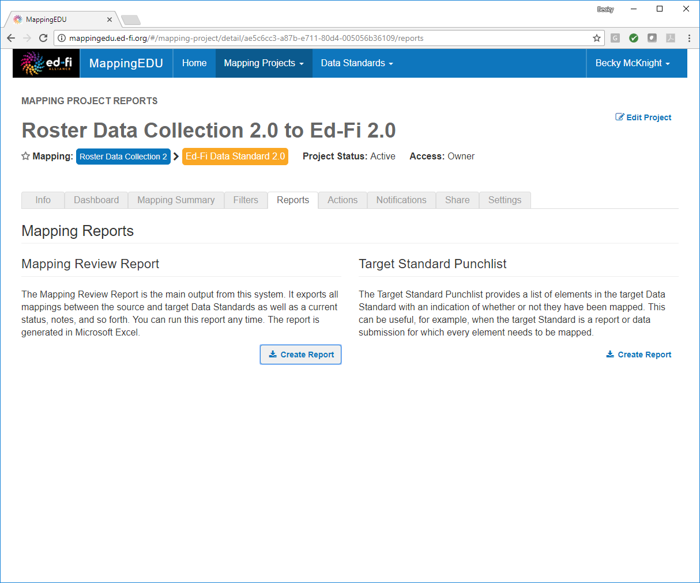
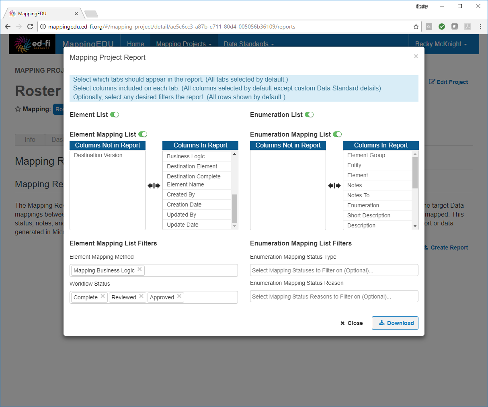
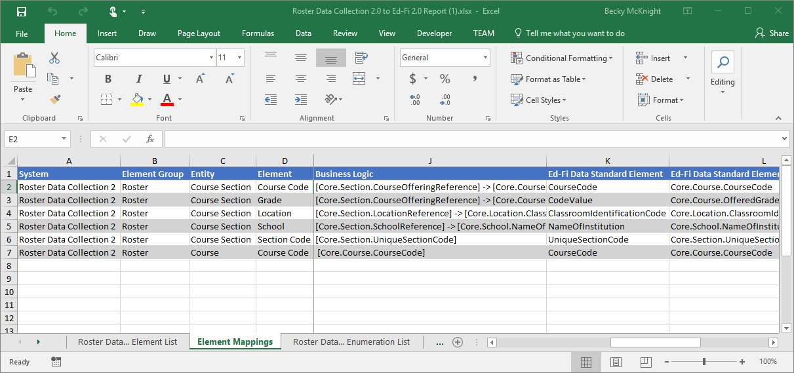
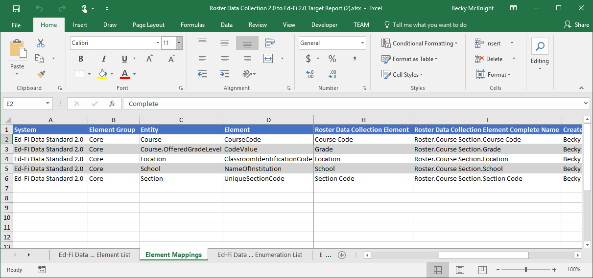

# 1.12 - Export into Excel

## Problem

The results of the mapping project are to be shared with others who are
not MappingEDU users.

## Solution

Export the mapping project into Excel.

## Discussion

The results of a mapping project are easy to export into Excel.

From the **Reports** tab of the mapping project, click **Create Report**
under the **Mapping Review Report option.**

By default, all columns are automatically included. Remove any
unnecessary fields by clicking the field in the **Columns in Report**
list. To add any removed columns back in, simply click the column in the
**Columns Not in Report** list. Set any desired filters for the mapping
method and workflow status and click **Download.**

The project results are exported to Excel.

The **Target Standard Punchlist** report option generates a similar
report, but from the perspective of the target data standard. Rather
than showing source data standard elements and the target elements to
which they are mapped, the **Target Standard Punchlist** shows target
standard elements and the source standard elements that mapped to them.

## Cookbook Contents

Find out what you can cook with MappingEDU:

* [1.1 - Format a Source Standard for Upload](1.1_-_Format_a_Source_Standard_for_Upload.md)
* [1.2 - Upload a Source Standard](1.2_-_Upload_a_Source_Standard.md)
* [1.3 - Create a Mapping Project](1.3_-_Create_a_Mapping_Project.md)
* [1.4 - Use the Mapping Helper](1.4_-_Use_the_Mapping_Helper.md)
* [1.5 - Filter Lists](1.5_-_Filter_Lists.md)
* [1.6 - Map an Element](1.6_-_Map_an_Element.md)
* [1.7 - Map an Element Using Matchmaker](1.7_-_Map_an_Element_Using_Matchmaker.md)
* [1.8 - Mark an Element for Extension / Omission](1.8_-_Mark_an_Element_for_Extension_Omission.md)
* [1.9 - Use Templates to Create Shortcuts](1.9_-_Use_Templates_to_Create_Shortcuts.md)
* [1.10 - Map an Enumeration](1.10_-_Map_an_Enumeration.md)
* [1.11 - Update Multiple Elements Simultaneously](1.11_-_Update_Multiple_Elements_Simultaneously.md)
* [1.12 - Export into Excel](1.12_-_Export_into_Excel.md)
* [1.13 - Collaborate with Other Users](1.13_-_Collaborate_with_Other_Users.md)
* [1.14 - Upload Ed-Fi ODS / API Endpoints](1.14_-_Upload_Ed-Fi_ODS_API_Endpoints.md)
* [1.15 - Review Common Extensions](1.15_-_Review_Common_Extensions.md)
