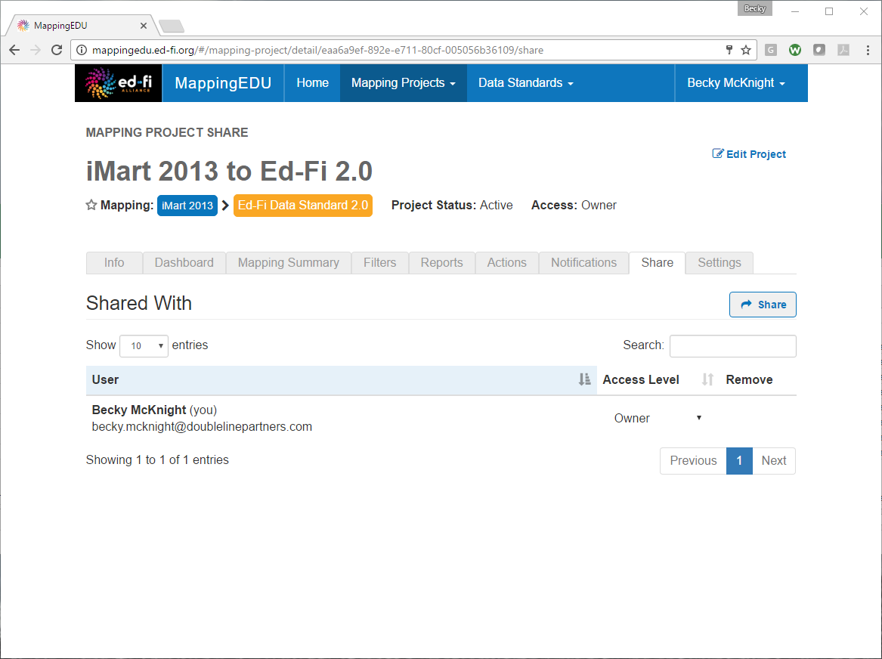
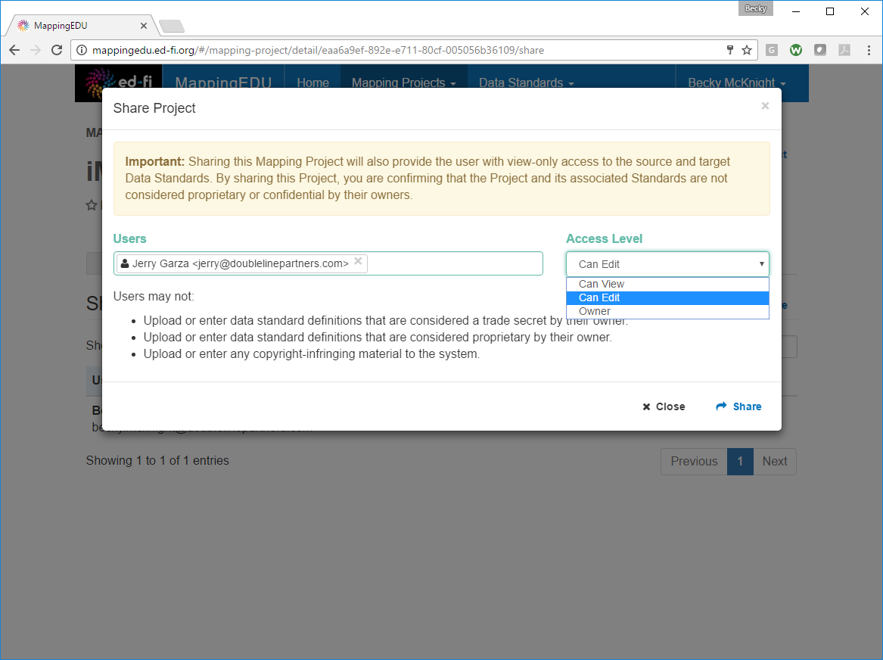
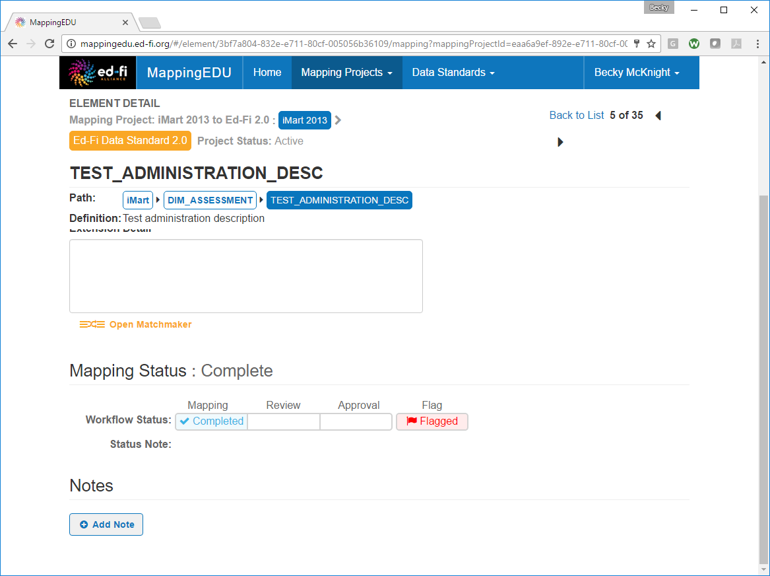
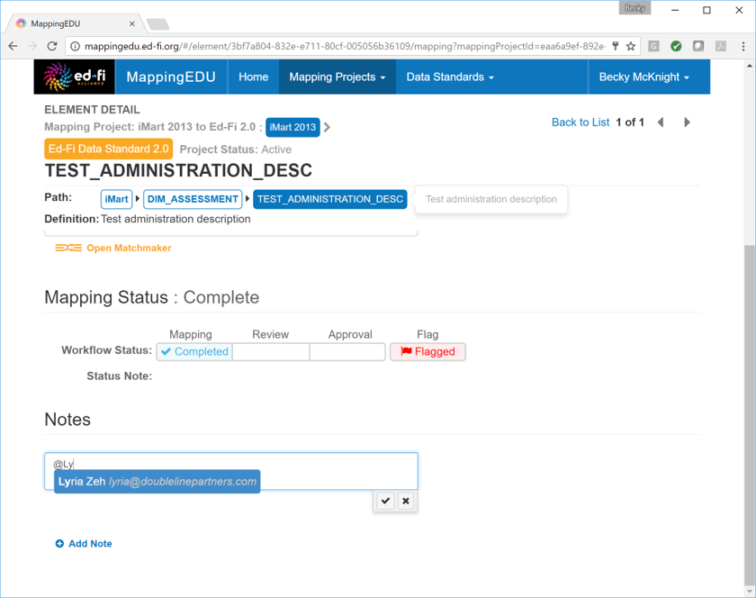
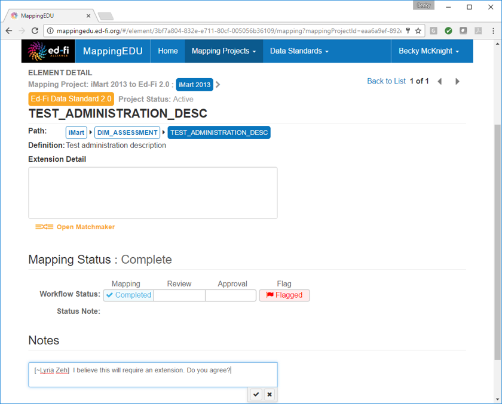
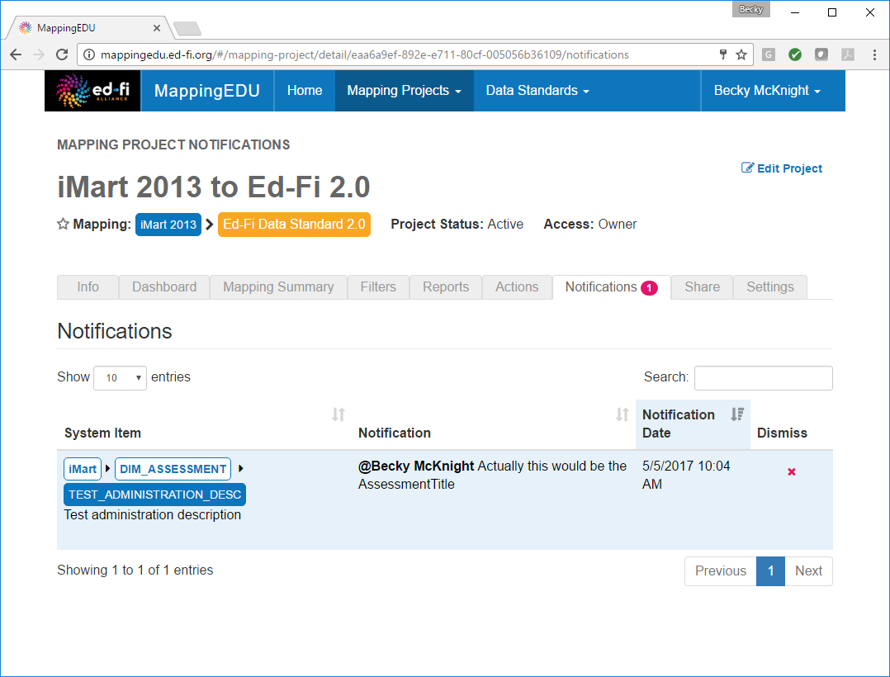
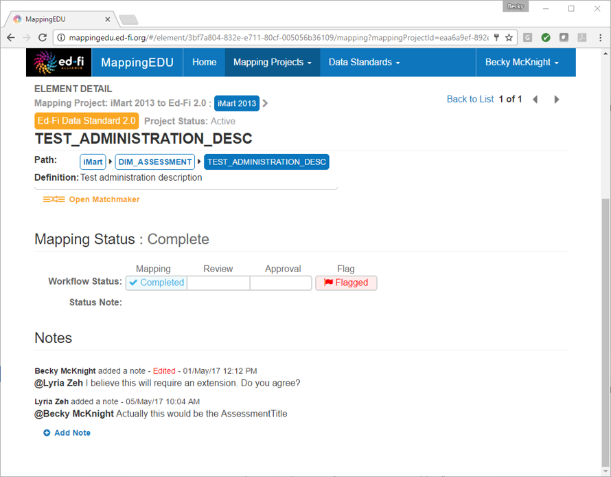

# 1.13 - Collaborate with Other Users

## Problem

Other users should have access to view or edit data standards or
projects and provide feedback.

## Solution

Add other users to mapping projects and tag them in notes to solicit
their feedback.

## Discussion

MappingEDU allows users to work as a team to complete mapping projects.

To add users to a mapping project, click the **Share** tab of the
mapping project.

Type the user name, and set the appropriate access level. Click
**Share.**

Once users are added to a project, users may be tagged in notes to draw
the their attention to specific element mappings. To tag a user, click
**Add Note.**

Enter the **@** symbol and begin typing the user's user name.

Select the correct user, enter the note, and click the check mark.

The user will receive a notification in their mapping project
**Notifications** tab. Clicking the notification will take the user
directly to the mapping for which the user was tagged.

The other user may then reply to the note, and the mapping may be
adjusted accordingly.

## Cookbook Contents

Find out what you can cook with MappingEDU:

* [1.1 - Format a Source Standard for Upload](1.1_-_Format_a_Source_Standard_for_Upload.md)
* [1.2 - Upload a Source Standard](1.2_-_Upload_a_Source_Standard.md)
* [1.3 - Create a Mapping Project](1.3_-_Create_a_Mapping_Project.md)
* [1.4 - Use the Mapping Helper](1.4_-_Use_the_Mapping_Helper.md)
* [1.5 - Filter Lists](1.5_-_Filter_Lists.md)
* [1.6 - Map an Element](1.6_-_Map_an_Element.md)
* [1.7 - Map an Element Using Matchmaker](1.7_-_Map_an_Element_Using_Matchmaker.md)
* [1.8 - Mark an Element for Extension / Omission](1.8_-_Mark_an_Element_for_Extension_Omission.md)
* [1.9 - Use Templates to Create Shortcuts](1.9_-_Use_Templates_to_Create_Shortcuts.md)
* [1.10 - Map an Enumeration](1.10_-_Map_an_Enumeration.md)
* [1.11 - Update Multiple Elements Simultaneously](1.11_-_Update_Multiple_Elements_Simultaneously.md)
* [1.12 - Export into Excel](1.12_-_Export_into_Excel.md)
* [1.13 - Collaborate with Other Users](1.13_-_Collaborate_with_Other_Users.md)
* [1.14 - Upload Ed-Fi ODS / API Endpoints](1.14_-_Upload_Ed-Fi_ODS_API_Endpoints.md)
* [1.15 - Review Common Extensions](1.15_-_Review_Common_Extensions.md)
