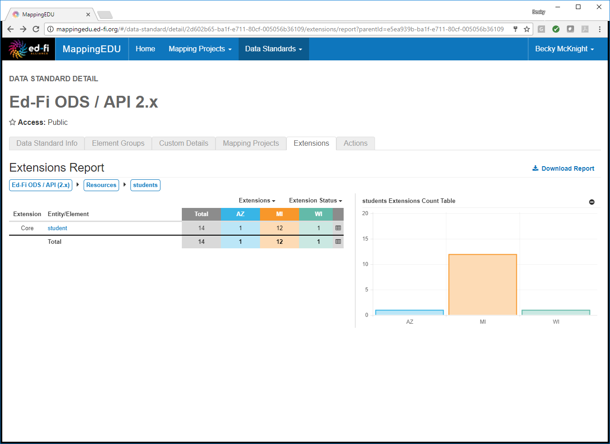

# 1.15 - Review Common Extensions

## Problem

An implementation has identified a potential area for extension, but it
would be helpful to first see how other implementations have extended in
this area.

## Solution

Review the Extensions report for the Ed-Fi ODS / API.

## Discussion

Three states (Arizona, Michigan, and Wisconsin) have agreed to share
details about extensions they have added. To view these extensions, go
to the most recent version of the Ed-Fi ODS / API data standard.

The **Extensions** tab provides a high-level overview of the number of
Descriptors, Resources, and Types that have been added for each of the
three states.

Several options are available to drill-down into this data.

To filter the view to show only the extensions of one or some of the
states, click the **Extensions** drop-down, and use the multi-select
feature to select the desired states. Note that the bar chart to the
right will automatically update according to your selections.

To see a list of the extended entities or elements for a particular
category for all states, click the category name. For example, the view
below was achieved by clicking on **Resources** in the Entity/Element
column. Note that the bar chart to the right automatically updates to
show a breakdown of extensions just in that category.

The extension column displays **Core** when one or more implementations
have extended a Core Entity.  When an implementation has added a new
entity, the **Extensions** column displays the implementation's two
character abbreviated code.  

If the **Entity/Element** column is hyperlinked, you are viewing an
entity which has sub-entities or elements.

You may continue to drill-down by clicking on any of the listed
entities.

Elements are not hyperlinked indicating the end of a path. Core entities
elements that are not extended (in which **Total** column displays 0)
are included for reference.   Use the breadcrumbs at the top of the tab
to navigate back up to the desired level of aggregation.

Clicking on a cell in the table provides a list of the extensions for
that particular subcategory (and state, if applicable). Note that for
subcategories in which multiple states have added extensions, the list
is sorted into tabs for each state. Clicking the same cell again toggles
back to the bar chart view.

You may click **View Detailed List** to view a full filterable,
searchable list of all of the extensions for the chosen category.

To view the breakdown of extensions in a subcategory by state as a bar
chart, click the table icon in the far right corner for the desired
table row. Clicking the same icon again will toggle back to the bar
chart for the full category.

This data may also be exported into Excel for additional review. 

## Cookbook Contents

Find out what you can cook with MappingEDU:

* [1.1 - Format a Source Standard for Upload](1.1_-_Format_a_Source_Standard_for_Upload.md)
* [1.2 - Upload a Source Standard](1.2_-_Upload_a_Source_Standard.md)
* [1.3 - Create a Mapping Project](1.3_-_Create_a_Mapping_Project.md)
* [1.4 - Use the Mapping Helper](1.4_-_Use_the_Mapping_Helper.md)
* [1.5 - Filter Lists](1.5_-_Filter_Lists.md)
* [1.6 - Map an Element](1.6_-_Map_an_Element.md)
* [1.7 - Map an Element Using Matchmaker](1.7_-_Map_an_Element_Using_Matchmaker.md)
* [1.8 - Mark an Element for Extension / Omission](1.8_-_Mark_an_Element_for_Extension_Omission.md)
* [1.9 - Use Templates to Create Shortcuts](1.9_-_Use_Templates_to_Create_Shortcuts.md)
* [1.10 - Map an Enumeration](1.10_-_Map_an_Enumeration.md)
* [1.11 - Update Multiple Elements Simultaneously](1.11_-_Update_Multiple_Elements_Simultaneously.md)
* [1.12 - Export into Excel](1.12_-_Export_into_Excel.md)
* [1.13 - Collaborate with Other Users](1.13_-_Collaborate_with_Other_Users.md)
* [1.14 - Upload Ed-Fi ODS / API Endpoints](1.14_-_Upload_Ed-Fi_ODS_API_Endpoints.md)
* [1.15 - Review Common Extensions](1.15_-_Review_Common_Extensions.md)
