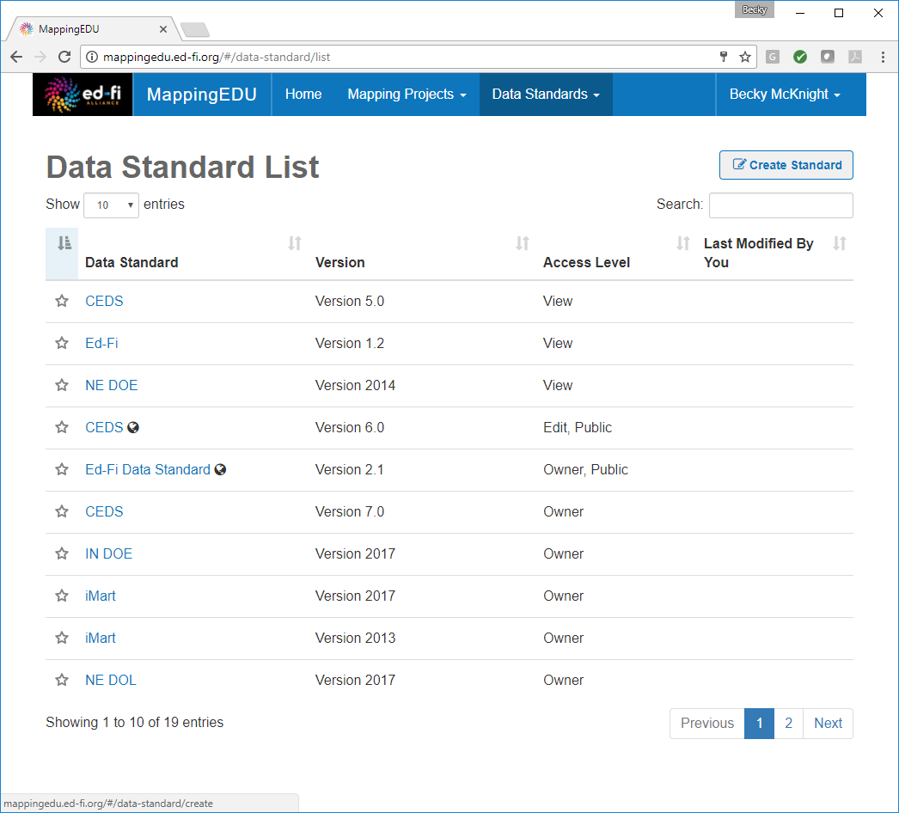
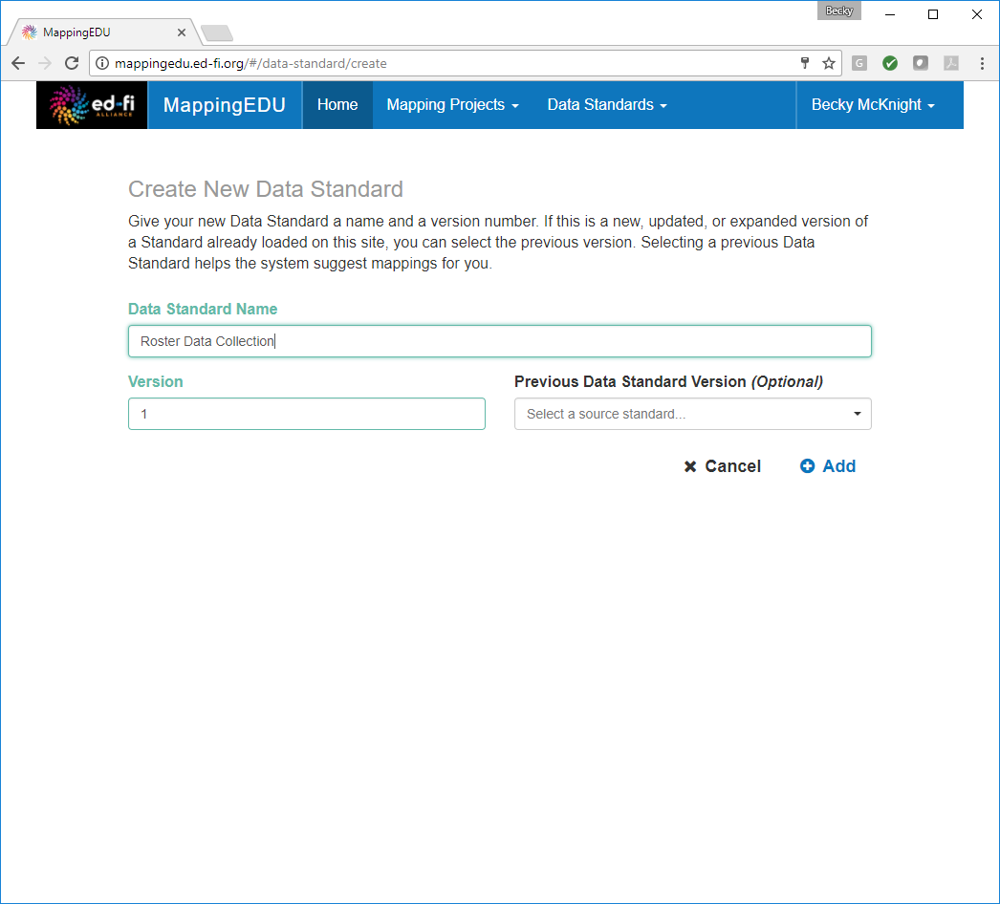
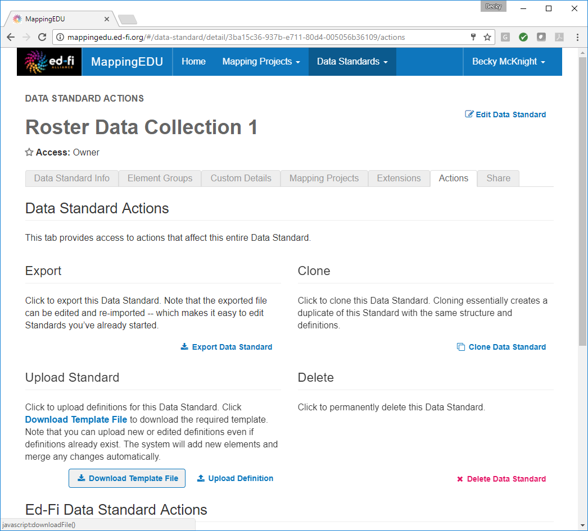

# 1.1 - Format a Source Standard for Upload

## Problem

The source standard needs to be in the proper format for upload into
MappingEDU.

## Solution

Download the template file from MappingEDU.

## Discussion

MappingEDU allows users to quickly and easily upload data standards and
collections. In order for this upload to take place, the data must be in
a standard format. A template is available for download, allowing users
to simply override the example data with the data from the standard to
be uploaded.

From the Data Standards menu, choose **View All Standards.** Click
 **Create Standard** in the upper right-hand corner.

Define the data standard or collection to be uploaded.

In the **Actions** tab, click **Download Template file.**

Open the **Excel template file** and replace example data with the
source data to be uploaded.

The sample file that is being used for this example is
attached: [roster.xlsx](roster.xlsx)

## Cookbook Contents

Find out what you can cook with MappingEDU:

* [1.1 - Format a Source Standard for Upload](1.1_-_Format_a_Source_Standard_for_Upload.md)
* [1.2 - Upload a Source Standard](1.2_-_Upload_a_Source_Standard.md)
* [1.3 - Create a Mapping Project](1.3_-_Create_a_Mapping_Project.md)
* [1.4 - Use the Mapping Helper](1.4_-_Use_the_Mapping_Helper.md)
* [1.5 - Filter Lists](1.5_-_Filter_Lists.md)
* [1.6 - Map an Element](1.6_-_Map_an_Element.md)
* [1.7 - Map an Element Using Matchmaker](1.7_-_Map_an_Element_Using_Matchmaker.md)
* [1.8 - Mark an Element for Extension / Omission](1.8_-_Mark_an_Element_for_Extension_Omission.md)
* [1.9 - Use Templates to Create Shortcuts](1.9_-_Use_Templates_to_Create_Shortcuts.md)
* [1.10 - Map an Enumeration](1.10_-_Map_an_Enumeration.md)
* [1.11 - Update Multiple Elements Simultaneously](1.11_-_Update_Multiple_Elements_Simultaneously.md)
* [1.12 - Export into Excel](1.12_-_Export_into_Excel.md)
* [1.13 - Collaborate with Other Users](1.13_-_Collaborate_with_Other_Users.md)
* [1.14 - Upload Ed-Fi ODS / API Endpoints](1.14_-_Upload_Ed-Fi_ODS_API_Endpoints.md)
* [1.15 - Review Common Extensions](1.15_-_Review_Common_Extensions.md)

