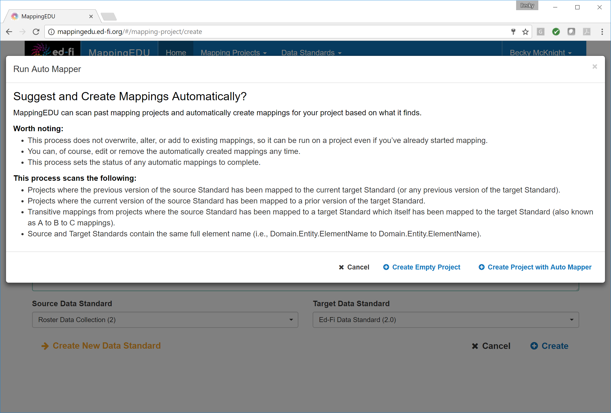
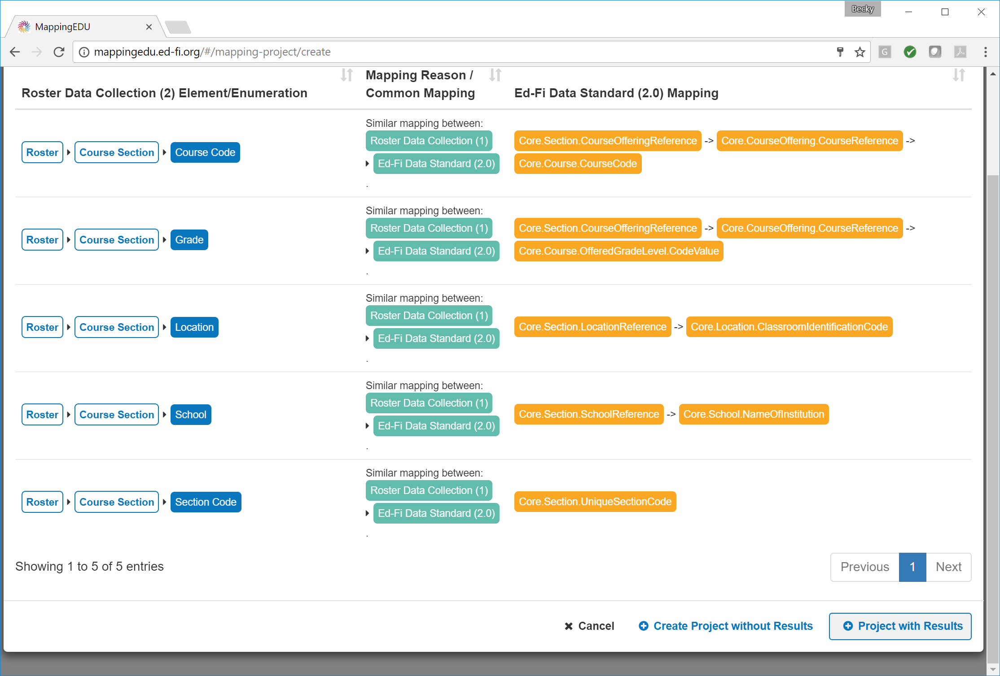
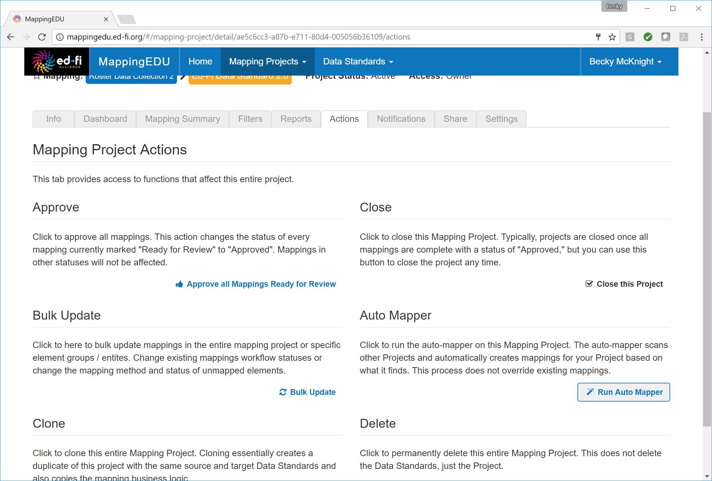
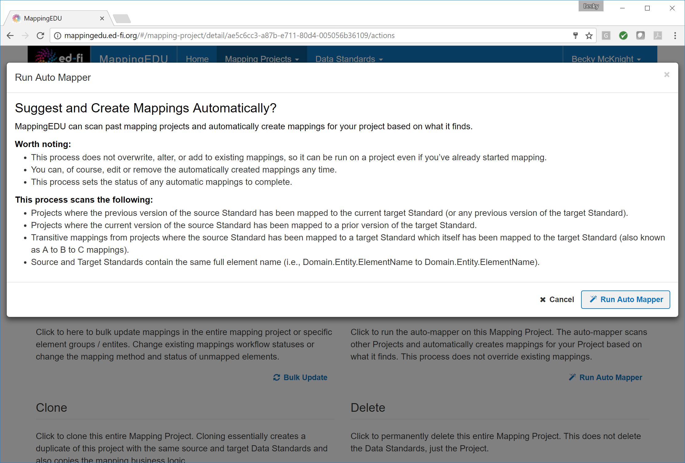
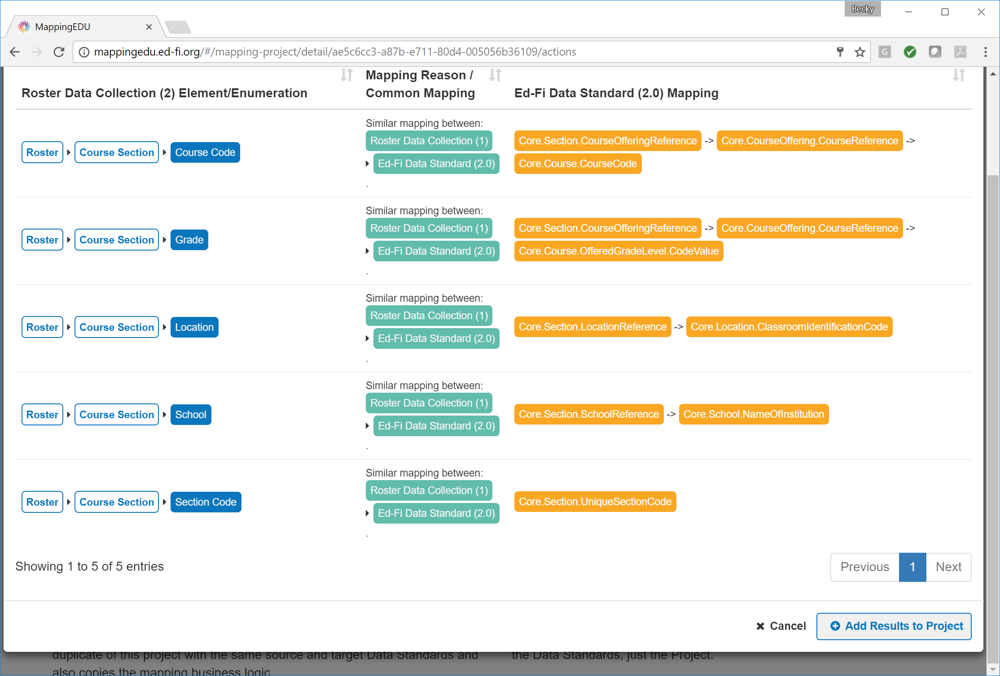

# 1.4 - Use the Mapping Helper

## Problem

The source data standard contains elements that are similar to elements
that have already been mapped in other mapping projects.

## Solution

Use the Mapping Helper feature to scan other mapping projects for
similar elements that have already been mapped to the target data
standard and import those mappings as applicable.

## Discussion

The Mapping Helper can provide a helpful starting point to mapping two
standards. It primarily looks for matching names and paths and suggests
mappings between elements. However, it's capabilities are limited. To
understand the tool in more detail, please consult: [User Guide -
Mapping Helper](Mapping_Helper).

The Mapping Helper may be used when creating a new project or in an
existing project.

When creating a new project, select **Create Project with Mapping
Helper.**

To accept the suggested mappings, click **Project With Results**.

For an existing mapping project, click the **Actions** tab and click
**Run Mapping Helper.**

Click **Run Mapping Helper** and review the suggested mappings.

To accept the suggestions, click **Add Results to Project.**

## Cookbook Contents

Find out what you can cook with MappingEDU:

* [1.1 - Format a Source Standard for Upload](1.1_-_Format_a_Source_Standard_for_Upload.md)
* [1.2 - Upload a Source Standard](1.2_-_Upload_a_Source_Standard.md)
* [1.3 - Create a Mapping Project](1.3_-_Create_a_Mapping_Project.md)
* [1.4 - Use the Mapping Helper](1.4_-_Use_the_Mapping_Helper.md)
* [1.5 - Filter Lists](1.5_-_Filter_Lists.md)
* [1.6 - Map an Element](1.6_-_Map_an_Element.md)
* [1.7 - Map an Element Using Matchmaker](1.7_-_Map_an_Element_Using_Matchmaker.md)
* [1.8 - Mark an Element for Extension / Omission](1.8_-_Mark_an_Element_for_Extension_Omission.md)
* [1.9 - Use Templates to Create Shortcuts](1.9_-_Use_Templates_to_Create_Shortcuts.md)
* [1.10 - Map an Enumeration](1.10_-_Map_an_Enumeration.md)
* [1.11 - Update Multiple Elements Simultaneously](1.11_-_Update_Multiple_Elements_Simultaneously.md)
* [1.12 - Export into Excel](1.12_-_Export_into_Excel.md)
* [1.13 - Collaborate with Other Users](1.13_-_Collaborate_with_Other_Users.md)
* [1.14 - Upload Ed-Fi ODS / API Endpoints](1.14_-_Upload_Ed-Fi_ODS_API_Endpoints.md)
* [1.15 - Review Common Extensions](1.15_-_Review_Common_Extensions.md)
