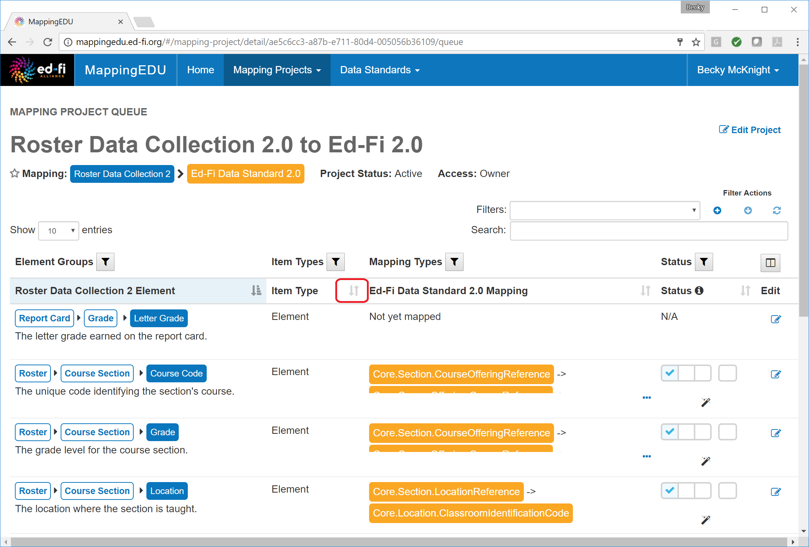
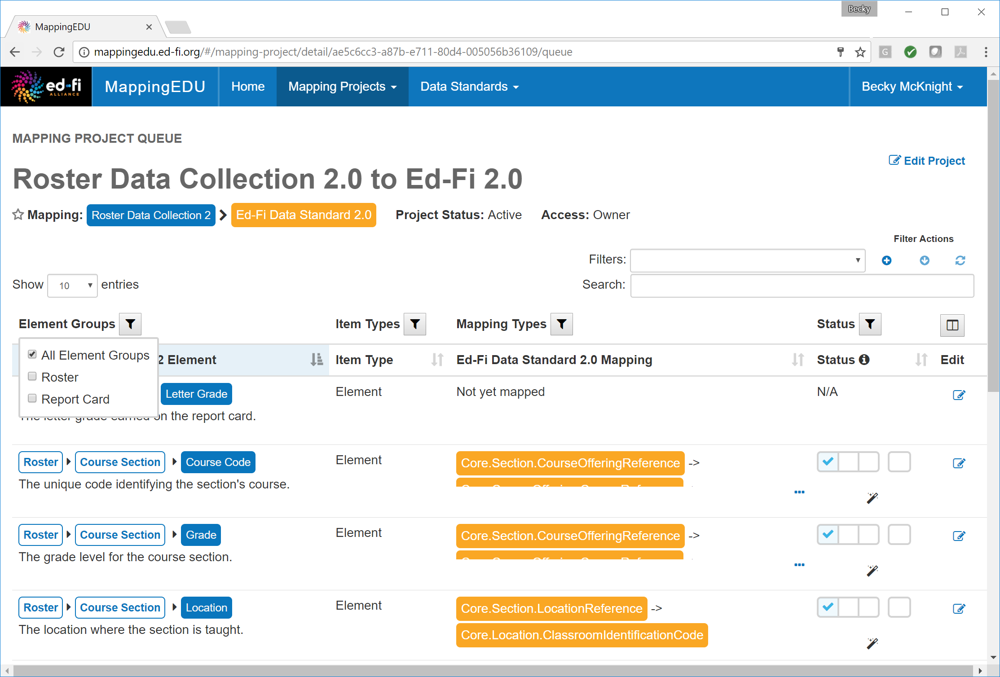
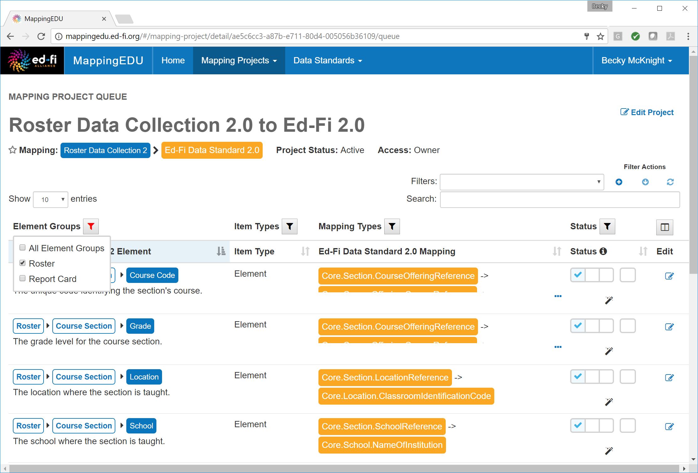
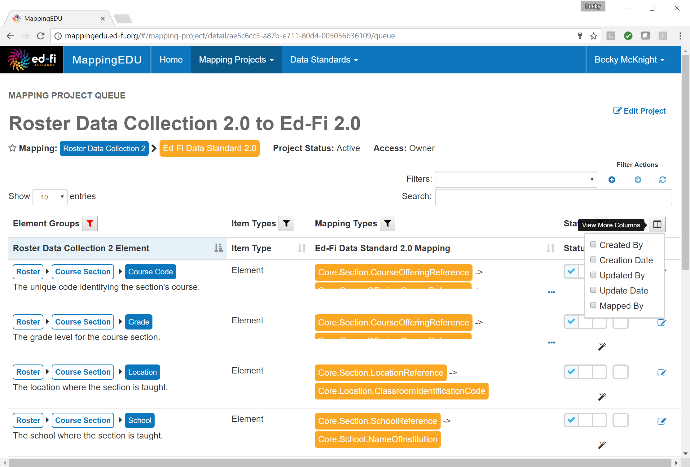
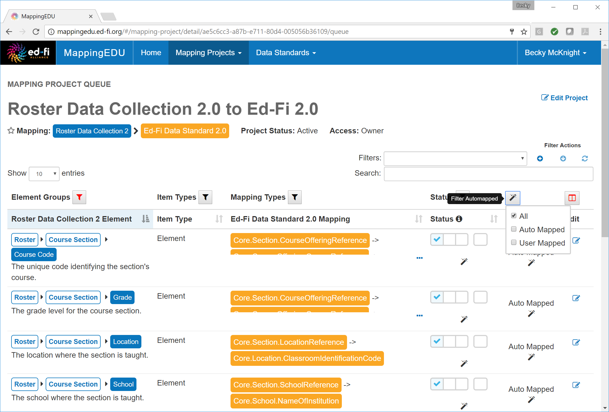
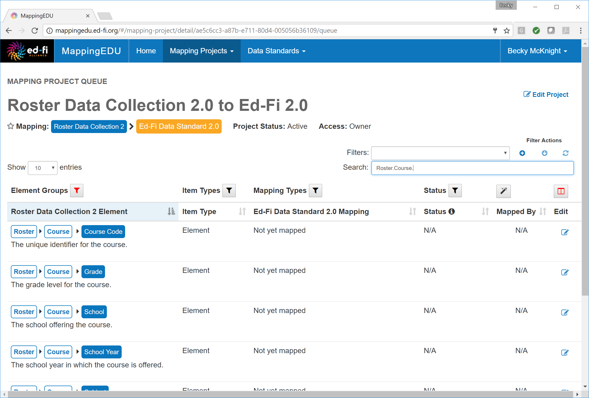
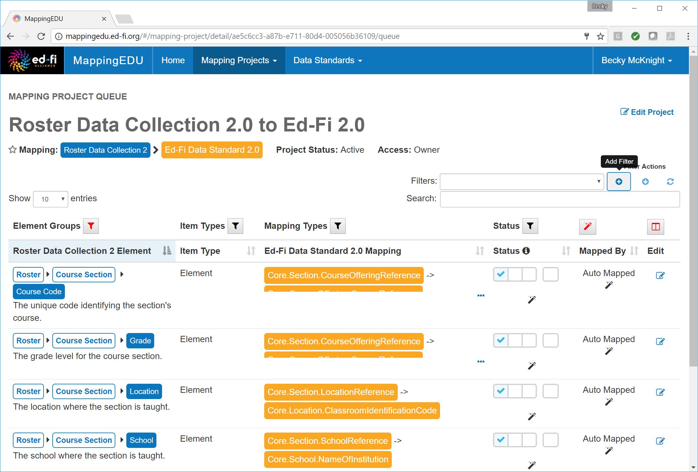
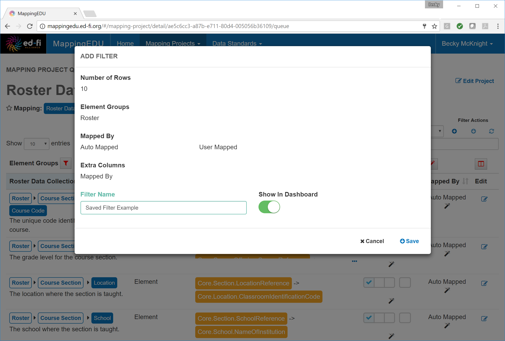
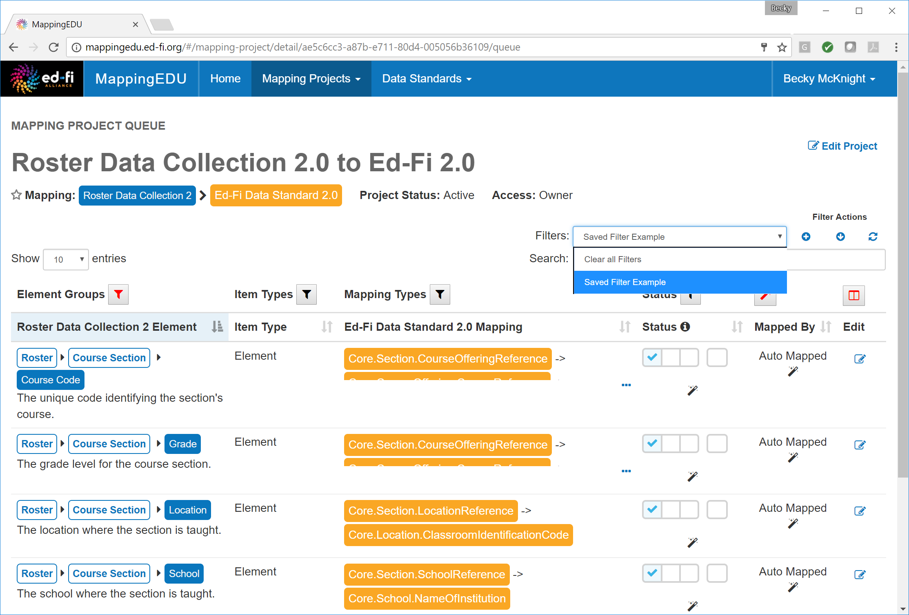
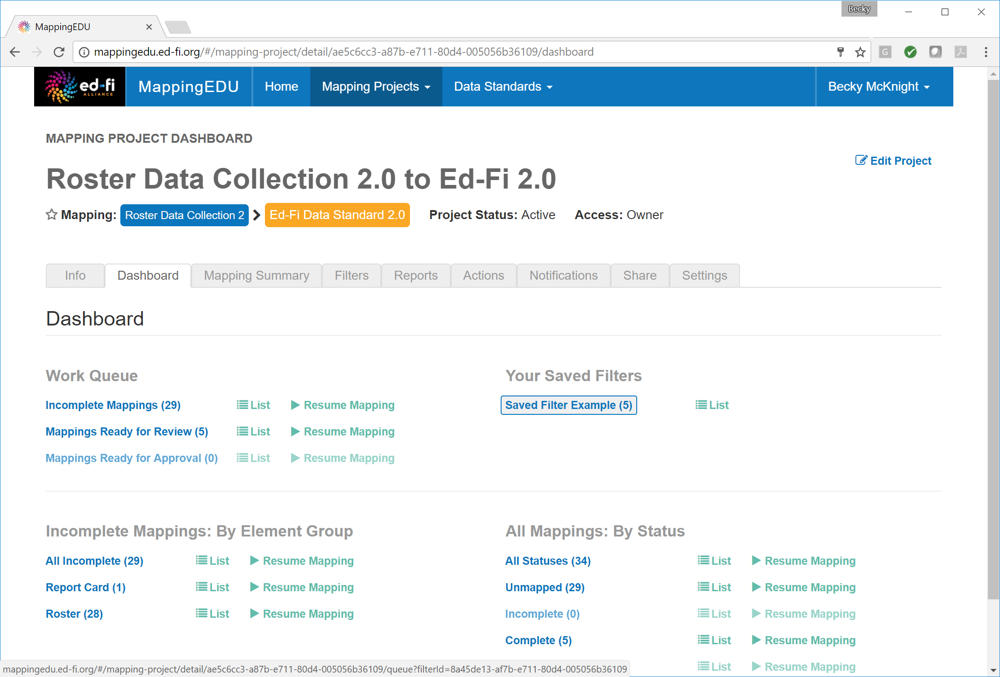

# 1.5 - Filter Lists

## Problem

The user needs to isolate a particular element or set of elements for
mapping or review.

## Solution

Use the filtering and sorting functionality to refine the list of
elements displayed.

## Discussion

Elements may be sorted or filtered by element group, item type (e.g.,
element or enumeration), mapping type (e.g., business logic, omission,
or extension), or by status (e.g., completed, reviewed, or approved).

Click the arrows next to a column heading to sort by that column.

Click the filter icon next to each column heading to further filter
results.

A red filter icon indicates that the list has been filtered by that
column. Click the filter icon to view the current filter settings.

Additional columns may be added for sorting or filtering by clicking the
**View More Columns** icon and selecting the appropriate columns.

To filter by an added column, click the icon above the column.

You may also isolate elements by searching for keywords in the element's
path.

Filters may be saved and re-used in future mapping sessions. To save a
filter, click **Add Filter.**

Assign a name to the filter. To make the filter accessible from the
project's dashboard, click the **Show in Dashboard** toggle. Click
** Save.**

The filter can now be accessed and updated via the **Filters** drop-down
menu in the project queue.

If the saved filter was selected to be shown in the dashboard, the
filtered project queue may be launched directly from the dashboard.

## Cookbook Contents

Find out what you can cook with MappingEDU:

* [1.1 - Format a Source Standard for Upload](1.1_-_Format_a_Source_Standard_for_Upload.md)
* [1.2 - Upload a Source Standard](1.2_-_Upload_a_Source_Standard.md)
* [1.3 - Create a Mapping Project](1.3_-_Create_a_Mapping_Project.md)
* [1.4 - Use the Mapping Helper](1.4_-_Use_the_Mapping_Helper.md)
* [1.5 - Filter Lists](1.5_-_Filter_Lists.md)
* [1.6 - Map an Element](1.6_-_Map_an_Element.md)
* [1.7 - Map an Element Using Matchmaker](1.7_-_Map_an_Element_Using_Matchmaker.md)
* [1.8 - Mark an Element for Extension / Omission](1.8_-_Mark_an_Element_for_Extension_Omission.md)
* [1.9 - Use Templates to Create Shortcuts](1.9_-_Use_Templates_to_Create_Shortcuts.md)
* [1.10 - Map an Enumeration](1.10_-_Map_an_Enumeration.md)
* [1.11 - Update Multiple Elements Simultaneously](1.11_-_Update_Multiple_Elements_Simultaneously.md)
* [1.12 - Export into Excel](1.12_-_Export_into_Excel.md)
* [1.13 - Collaborate with Other Users](1.13_-_Collaborate_with_Other_Users.md)
* [1.14 - Upload Ed-Fi ODS / API Endpoints](1.14_-_Upload_Ed-Fi_ODS_API_Endpoints.md)
* [1.15 - Review Common Extensions](1.15_-_Review_Common_Extensions.md)
