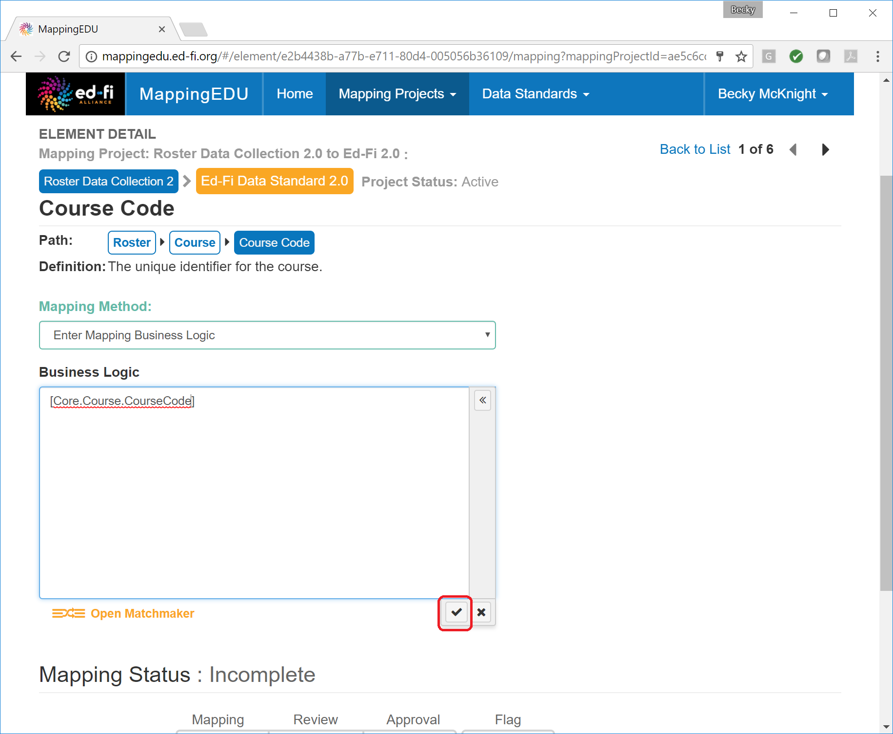

# 1.6 - Map an Element

## Problem

The user knows the correct mapping for an element and is ready to map
the element.

## Solution

Map the element directly.

## Discussion

From the **Mapping Method** drop-down, select **Enter Mapping Business
Logic.**

Begin typing the desired target standard element surrounded in brackets
(\[...\]) in the **Business Logic** text box. The auto complete utility
will suggest potential options as you type. Use the up and down keys or
the mouse to select an appropriate suggestion or simply continue typing.

After locating the desired target standard element, click the check-mark
in the bottom right-hand corner of the **Business Logic** text box.
MappingEDU will validate any text surrounded in brackets to ensure that
they are valid elements in the target data standard.

A valid element of the target data standard will display in orange.

If you've entered an invalid target data standard element, you will
receive an error message.

Once the mapping is complete, click the first bar of the **Workflow
Status** progress bar to indicate that mapping is complete.

## Cookbook Contents

Find out what you can cook with MappingEDU:

* [1.1 - Format a Source Standard for Upload](1.1_-_Format_a_Source_Standard_for_Upload.md)
* [1.2 - Upload a Source Standard](1.2_-_Upload_a_Source_Standard.md)
* [1.3 - Create a Mapping Project](1.3_-_Create_a_Mapping_Project.md)
* [1.4 - Use the Mapping Helper](1.4_-_Use_the_Mapping_Helper.md)
* [1.5 - Filter Lists](1.5_-_Filter_Lists.md)
* [1.6 - Map an Element](1.6_-_Map_an_Element.md)
* [1.7 - Map an Element Using Matchmaker](1.7_-_Map_an_Element_Using_Matchmaker.md)
* [1.8 - Mark an Element for Extension / Omission](1.8_-_Mark_an_Element_for_Extension_Omission.md)
* [1.9 - Use Templates to Create Shortcuts](1.9_-_Use_Templates_to_Create_Shortcuts.md)
* [1.10 - Map an Enumeration](1.10_-_Map_an_Enumeration.md)
* [1.11 - Update Multiple Elements Simultaneously](1.11_-_Update_Multiple_Elements_Simultaneously.md)
* [1.12 - Export into Excel](1.12_-_Export_into_Excel.md)
* [1.13 - Collaborate with Other Users](1.13_-_Collaborate_with_Other_Users.md)
* [1.14 - Upload Ed-Fi ODS / API Endpoints](1.14_-_Upload_Ed-Fi_ODS_API_Endpoints.md)
* [1.15 - Review Common Extensions](1.15_-_Review_Common_Extensions.md)
