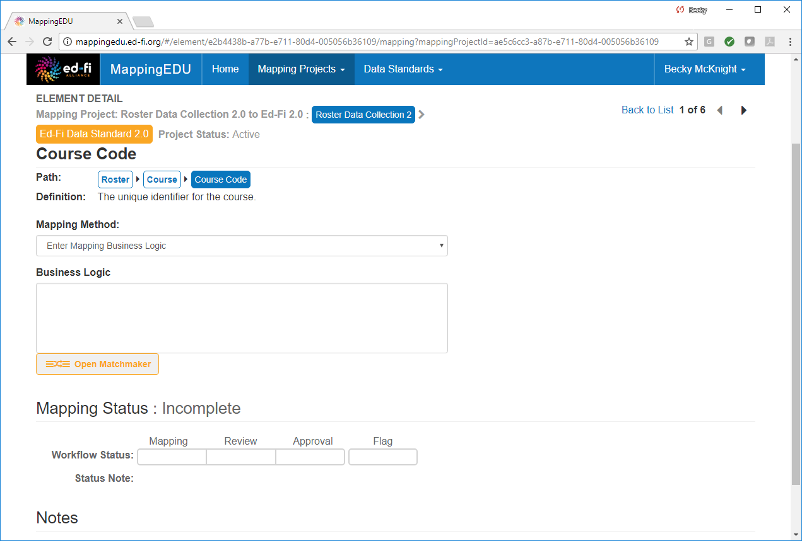
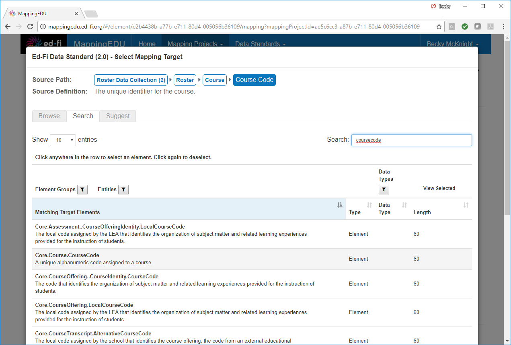
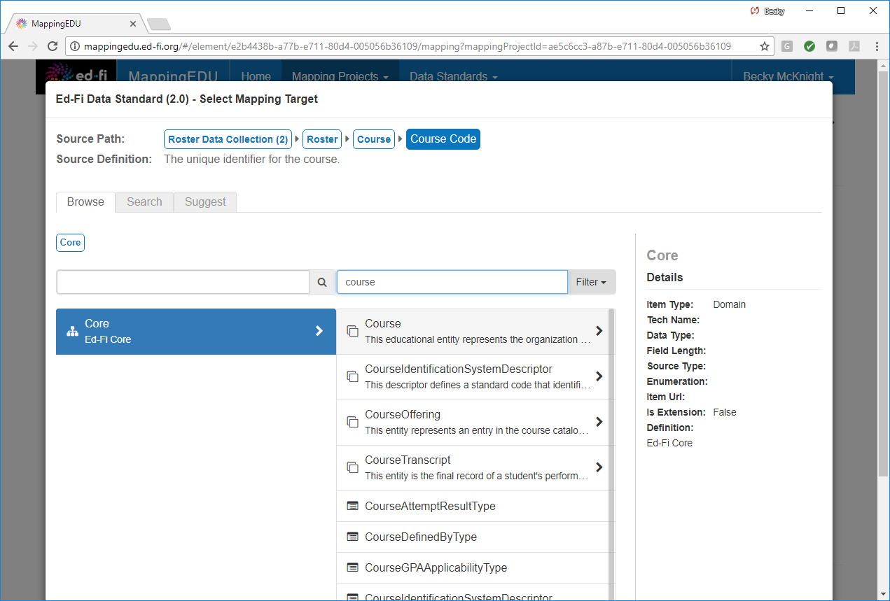
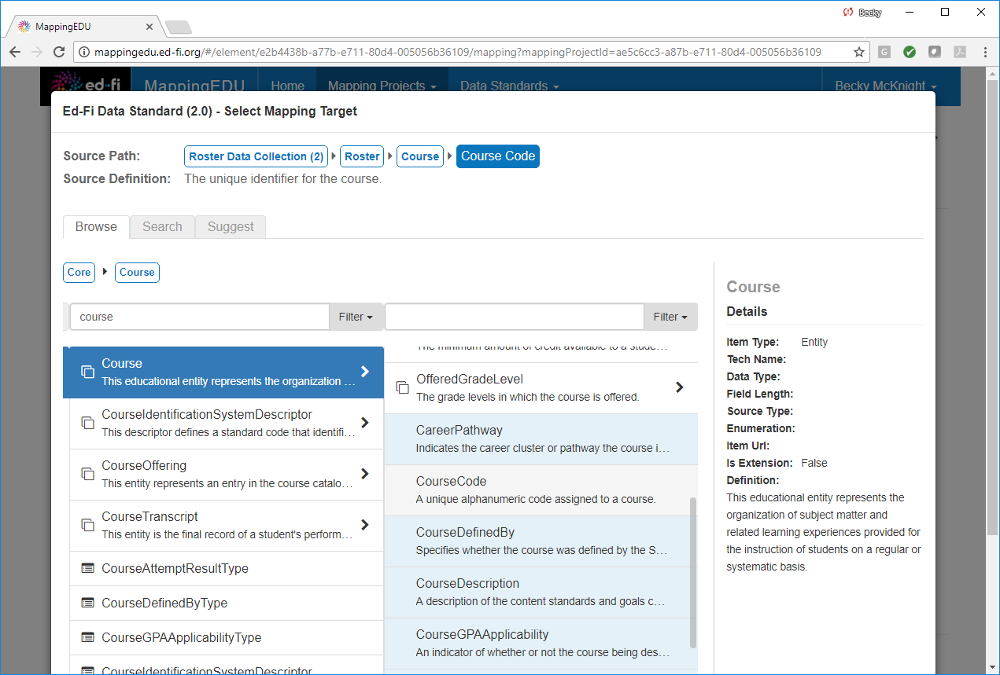
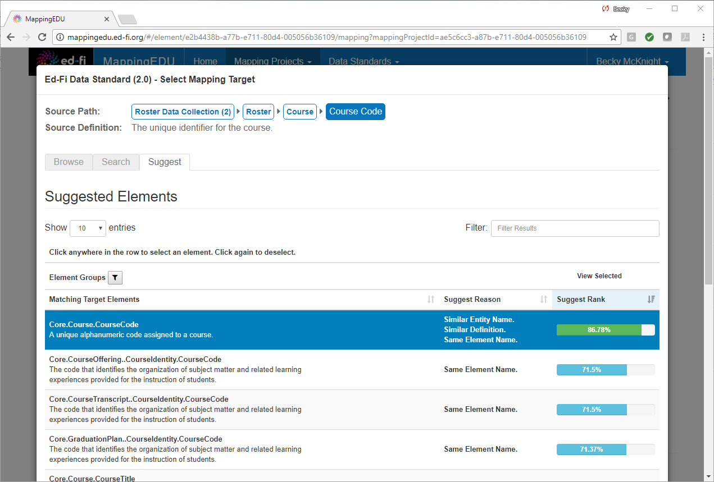
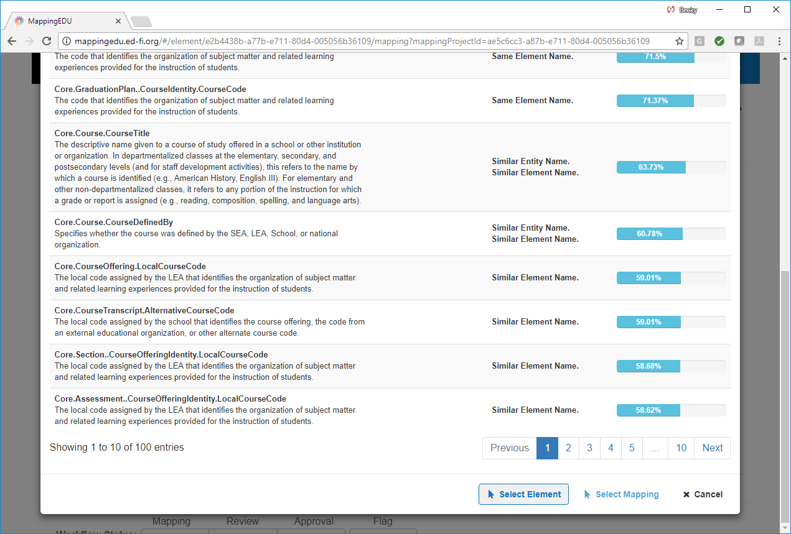
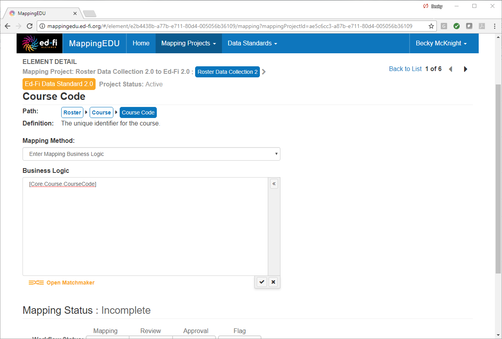

# 1.7 - Map an Element Using Matchmaker

## Problem

The user believes that the source standard element maps to a target
standard element, but does not know the exact target standard element or
its complete path.

## Solution

Use the matchmaker feature to find potential matches for the source
standard element.

## Discussion

The matchmaker feature allows users to browse or search for target
standard data elements. Additionally, the matchmaker feature suggests
likely matches.

To open the matchmaker, click the **Open Matchmaker** link below the
business logic text box.

The **search** tab allows you to search for potential matches using
keywords.

The **browse** tab allows you to browse through the target data
standard.

The **suggest** tab suggests likely matches in the target data standard.

To insert a field from the matchmaker, click the desired element, and
then scroll down and click **Select Element.**

The element is then inserted into the **Business Logic** text box.

Once the mapping is complete, the user may check the "Completed" box to
indicate the item's updated workflow.  

## Cookbook Contents

Find out what you can cook with MappingEDU:

* [1.1 - Format a Source Standard for Upload](1.1_-_Format_a_Source_Standard_for_Upload.md)
* [1.2 - Upload a Source Standard](1.2_-_Upload_a_Source_Standard.md)
* [1.3 - Create a Mapping Project](1.3_-_Create_a_Mapping_Project.md)
* [1.4 - Use the Mapping Helper](1.4_-_Use_the_Mapping_Helper.md)
* [1.5 - Filter Lists](1.5_-_Filter_Lists.md)
* [1.6 - Map an Element](1.6_-_Map_an_Element.md)
* [1.7 - Map an Element Using Matchmaker](1.7_-_Map_an_Element_Using_Matchmaker.md)
* [1.8 - Mark an Element for Extension / Omission](1.8_-_Mark_an_Element_for_Extension_Omission.md)
* [1.9 - Use Templates to Create Shortcuts](1.9_-_Use_Templates_to_Create_Shortcuts.md)
* [1.10 - Map an Enumeration](1.10_-_Map_an_Enumeration.md)
* [1.11 - Update Multiple Elements Simultaneously](1.11_-_Update_Multiple_Elements_Simultaneously.md)
* [1.12 - Export into Excel](1.12_-_Export_into_Excel.md)
* [1.13 - Collaborate with Other Users](1.13_-_Collaborate_with_Other_Users.md)
* [1.14 - Upload Ed-Fi ODS / API Endpoints](1.14_-_Upload_Ed-Fi_ODS_API_Endpoints.md)
* [1.15 - Review Common Extensions](1.15_-_Review_Common_Extensions.md)
