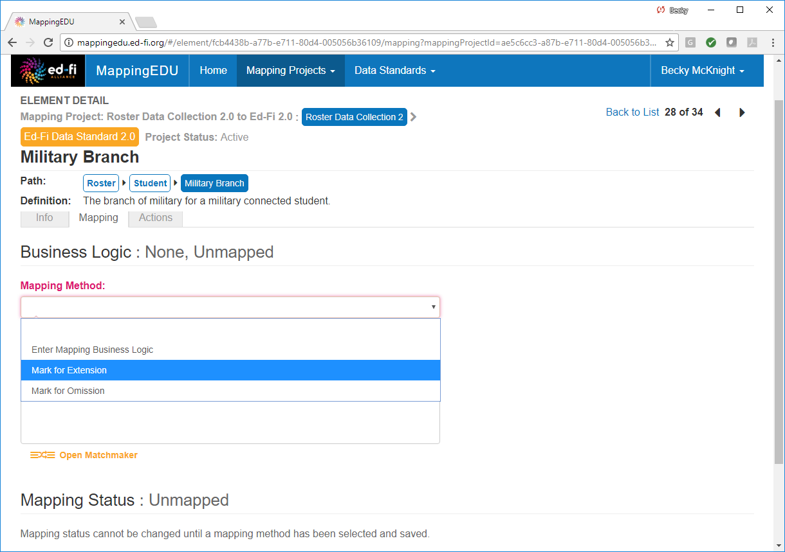
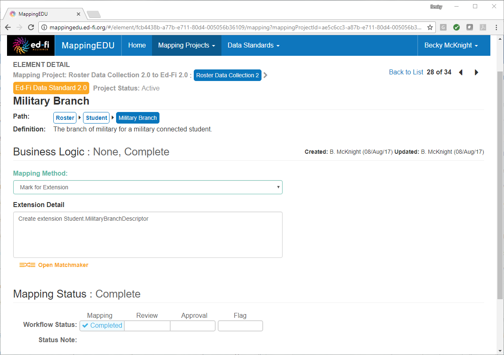
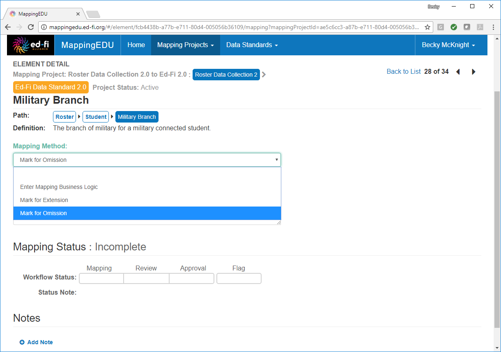
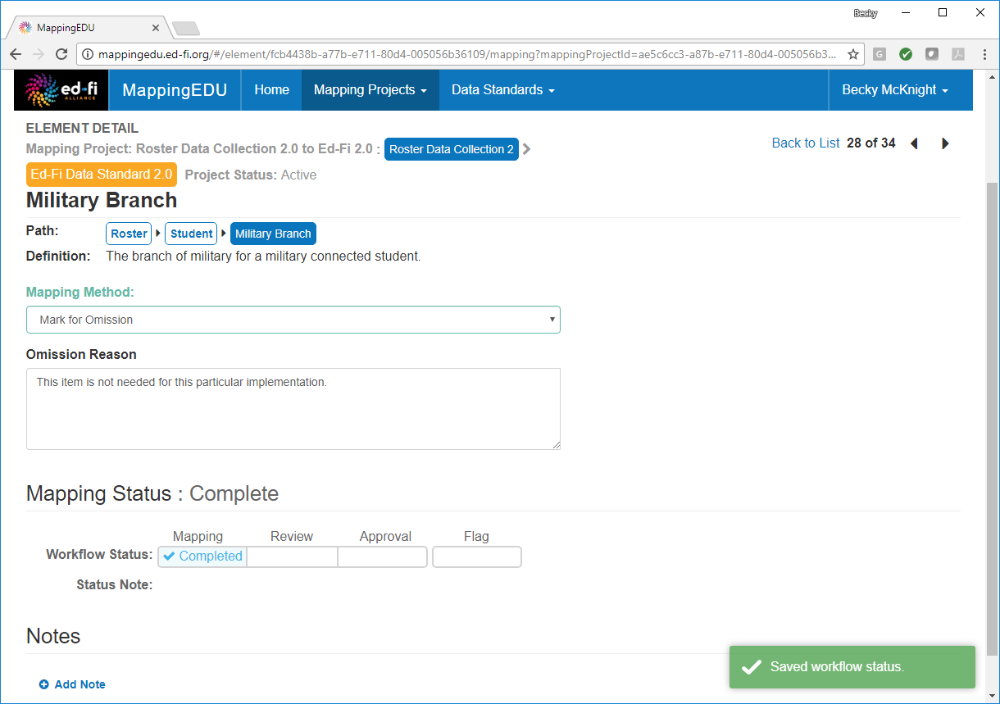

# 1.8 - Mark an Element for Extension / Omission

## Problem

The source standard element does not map to any existing target standard
element.

## Solution

Mark the item for extension or omission using the **Mapping Method**
drop-down menu.

## Discussion

During a mapping project, not all items will align. Some items in the
source standard may be identified for potential extension in the target
standard or may be otherwise omitted for implementation. 

For an item that you would like to mark for extension in the target data
standard, choose **Mark for Extension** from the **Mapping Method**
drop-down menu.

Enter the details about your proposed extension(s) in the **Mark for
Extension** text box and update the workflow status to indicate that
mapping is complete for this item.

For an item that you believe should be omitted from further
consideration, select **Mark for Omission** from the **Mapping Method**
drop-down menu.

Provide any notes to explain why the item is not applicable to the
project, and update the workflow status to indicate that mapping is
complete for this item.

## Cookbook Contents

Find out what you can cook with MappingEDU:

* [1.1 - Format a Source Standard for Upload](1.1_-_Format_a_Source_Standard_for_Upload.md)
* [1.2 - Upload a Source Standard](1.2_-_Upload_a_Source_Standard.md)
* [1.3 - Create a Mapping Project](1.3_-_Create_a_Mapping_Project.md)
* [1.4 - Use the Mapping Helper](1.4_-_Use_the_Mapping_Helper.md)
* [1.5 - Filter Lists](1.5_-_Filter_Lists.md)
* [1.6 - Map an Element](1.6_-_Map_an_Element.md)
* [1.7 - Map an Element Using Matchmaker](1.7_-_Map_an_Element_Using_Matchmaker.md)
* [1.8 - Mark an Element for Extension / Omission](1.8_-_Mark_an_Element_for_Extension_Omission.md)
* [1.9 - Use Templates to Create Shortcuts](1.9_-_Use_Templates_to_Create_Shortcuts.md)
* [1.10 - Map an Enumeration](1.10_-_Map_an_Enumeration.md)
* [1.11 - Update Multiple Elements Simultaneously](1.11_-_Update_Multiple_Elements_Simultaneously.md)
* [1.12 - Export into Excel](1.12_-_Export_into_Excel.md)
* [1.13 - Collaborate with Other Users](1.13_-_Collaborate_with_Other_Users.md)
* [1.14 - Upload Ed-Fi ODS / API Endpoints](1.14_-_Upload_Ed-Fi_ODS_API_Endpoints.md)
* [1.15 - Review Common Extensions](1.15_-_Review_Common_Extensions.md)
