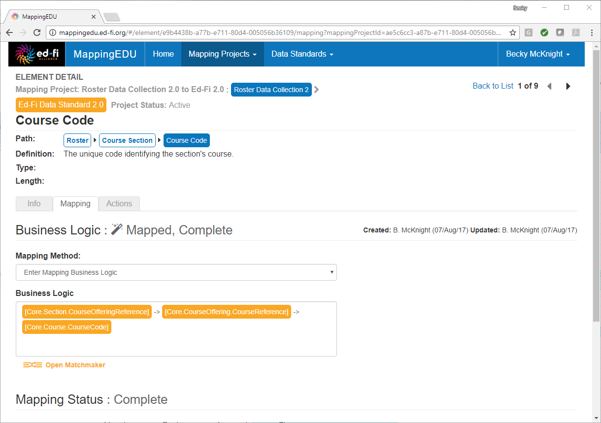
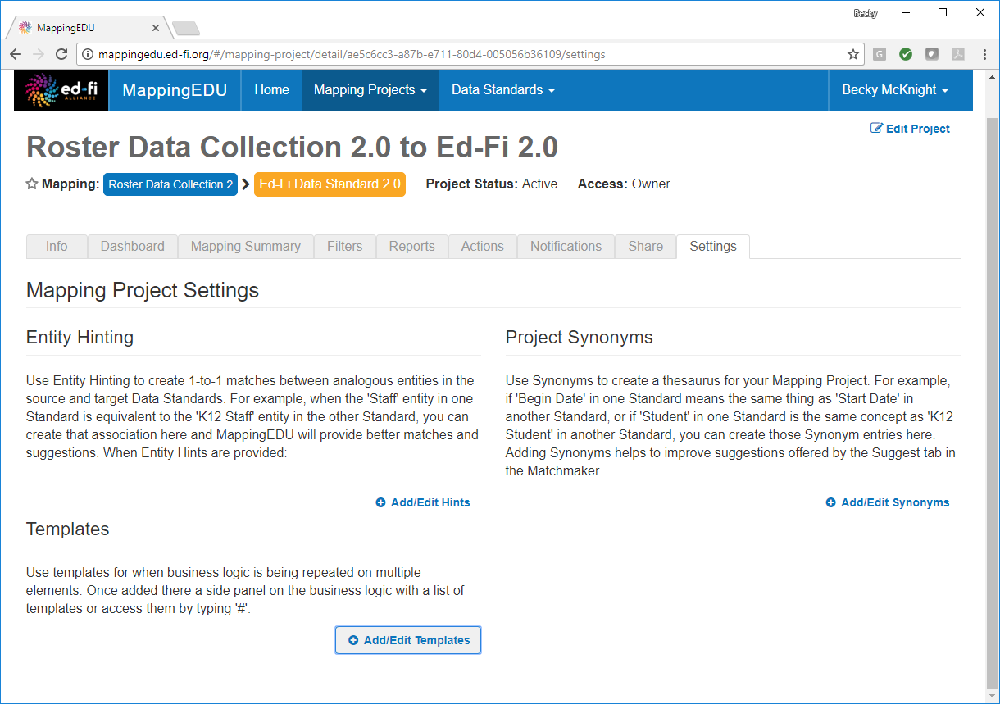
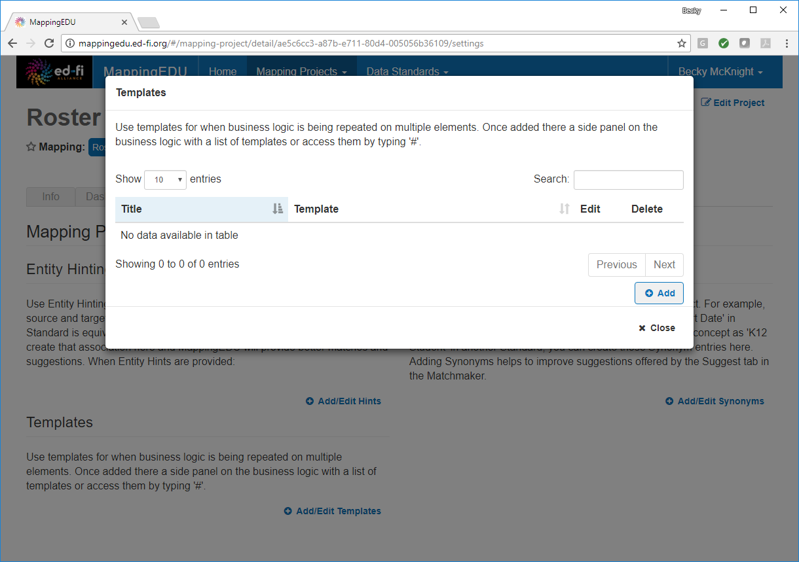
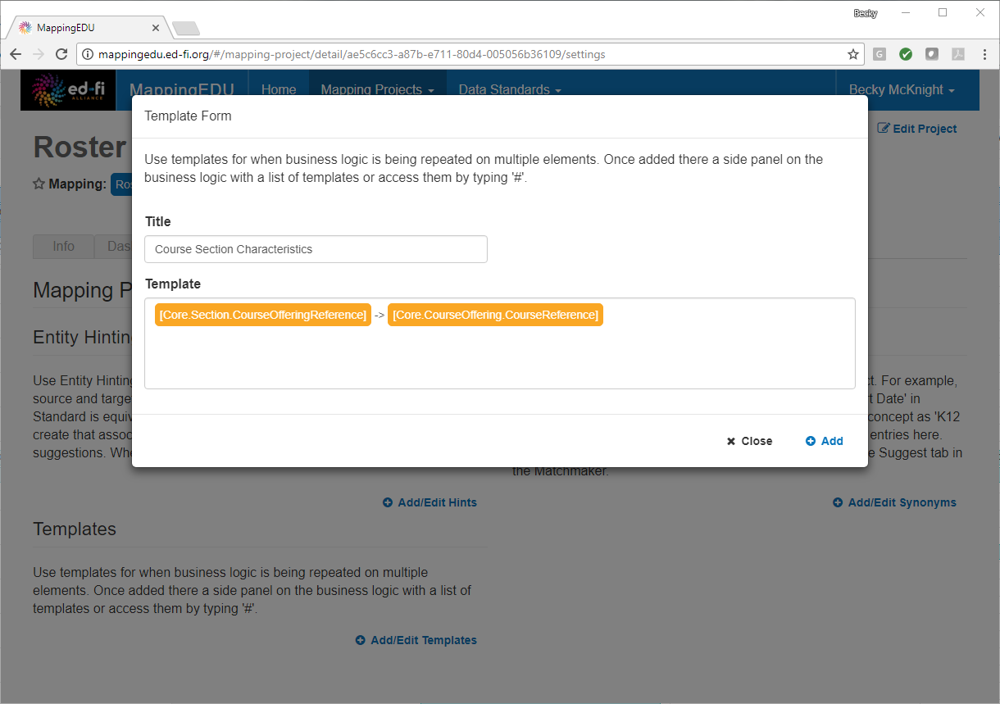
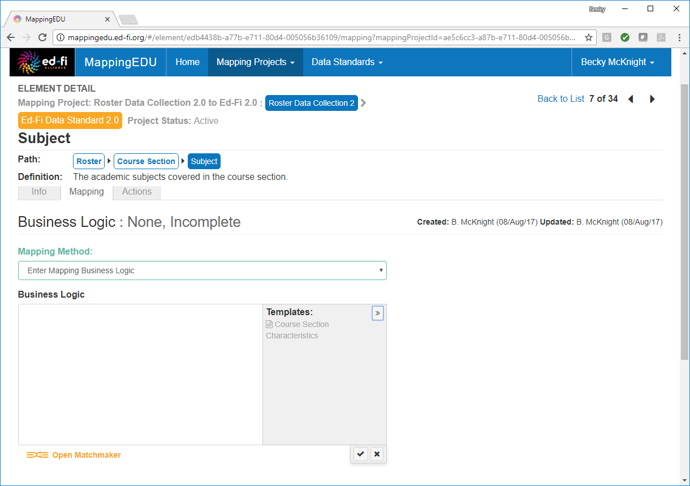
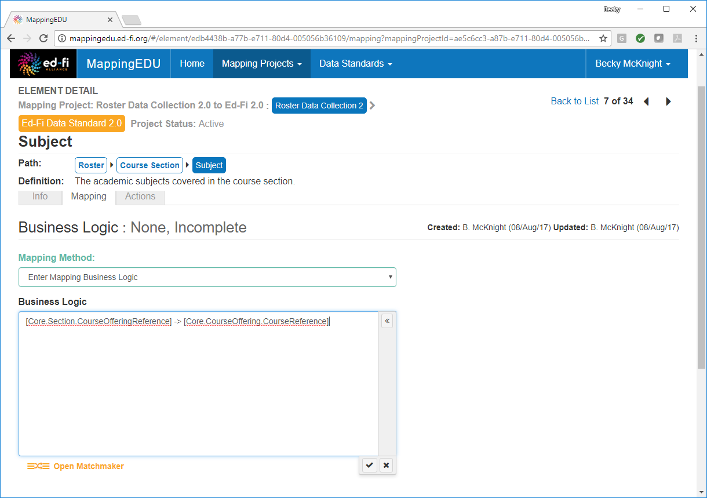
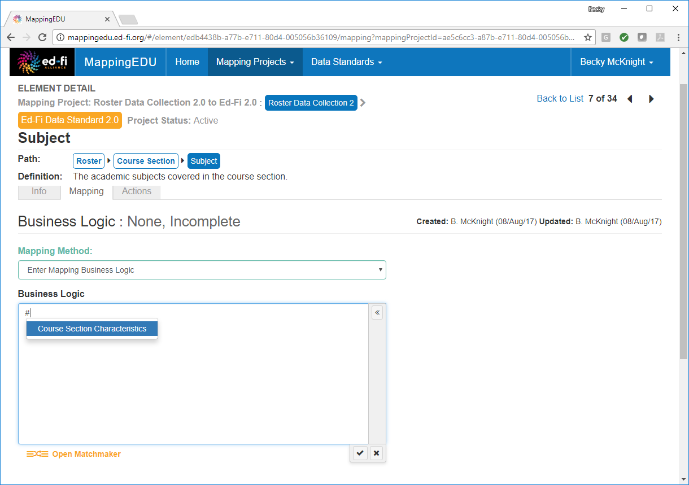
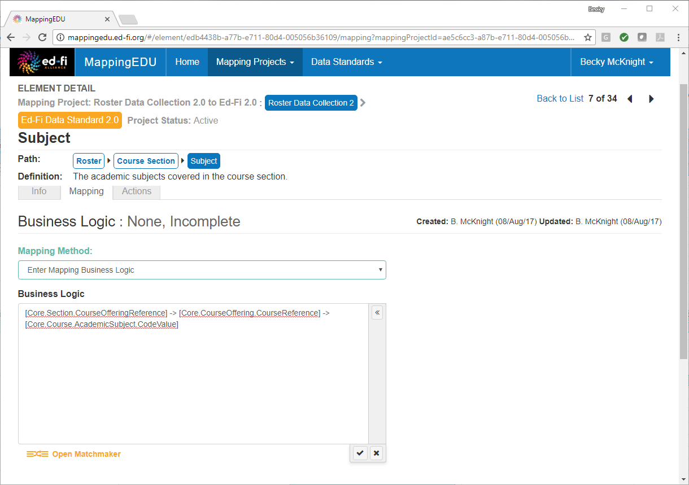

# 1.9 - Use Templates to Create Shortcuts

## Problem

A set of elements require complex mapping, part of which is the same for
many of the elements.

## Solution

Use a template to save common mapping expressions rather than retyping
them for each element.

## Discussion

Saving parts of business logic that are frequently reused for many
elements as a template can significantly reduce the time required to
complete a mapping project.

For example, the following business logic is used as part of the mapping
for several elements in this project.

Rather than typing this out for each mapping, the common expression to
be reused may be saved as a template.

Copy the common expression to be added, and then go to the **Settings**
tab of the mapping project and click **Add/Edit Templates.**

Click **Add.**

Provide a descriptive title for the template, and then paste (or type)
the common expression into the Template text box. Click **Add.** Then
click **Close.**

To insert the common expression into the business logic for an element,
choose **Enter Mapping Business Logic** from the **Mapping Method**
drop-down menu, and then click inside the **Business Logic** text box.
Click the double arrow \<\< to expand the **Templates** menu, and then
select the desired template from the list.

The common expression is then inserted into the **Business Logic** text
box.

You may also insert the common expression by typing the \# character,
and then selecting the desired template.

The business logic may then be adjusted to the individual element.

## Cookbook Contents

Find out what you can cook with MappingEDU:

* [1.1 - Format a Source Standard for Upload](1.1_-_Format_a_Source_Standard_for_Upload.md)
* [1.2 - Upload a Source Standard](1.2_-_Upload_a_Source_Standard.md)
* [1.3 - Create a Mapping Project](1.3_-_Create_a_Mapping_Project.md)
* [1.4 - Use the Mapping Helper](1.4_-_Use_the_Mapping_Helper.md)
* [1.5 - Filter Lists](1.5_-_Filter_Lists.md)
* [1.6 - Map an Element](1.6_-_Map_an_Element.md)
* [1.7 - Map an Element Using Matchmaker](1.7_-_Map_an_Element_Using_Matchmaker.md)
* [1.8 - Mark an Element for Extension / Omission](1.8_-_Mark_an_Element_for_Extension_Omission.md)
* [1.9 - Use Templates to Create Shortcuts](1.9_-_Use_Templates_to_Create_Shortcuts.md)
* [1.10 - Map an Enumeration](1.10_-_Map_an_Enumeration.md)
* [1.11 - Update Multiple Elements Simultaneously](1.11_-_Update_Multiple_Elements_Simultaneously.md)
* [1.12 - Export into Excel](1.12_-_Export_into_Excel.md)
* [1.13 - Collaborate with Other Users](1.13_-_Collaborate_with_Other_Users.md)
* [1.14 - Upload Ed-Fi ODS / API Endpoints](1.14_-_Upload_Ed-Fi_ODS_API_Endpoints.md)
* [1.15 - Review Common Extensions](1.15_-_Review_Common_Extensions.md)
