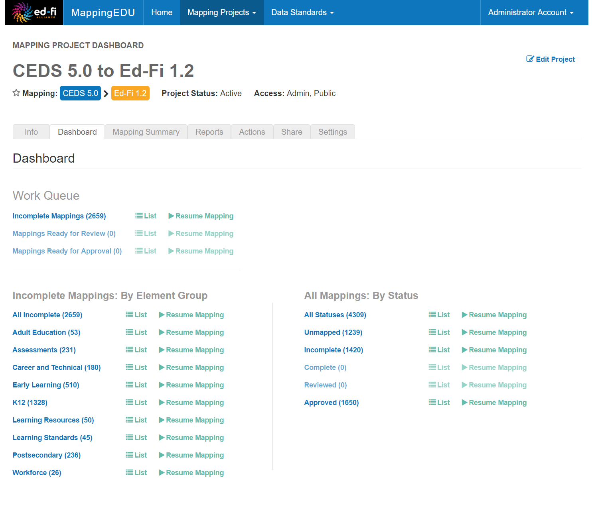
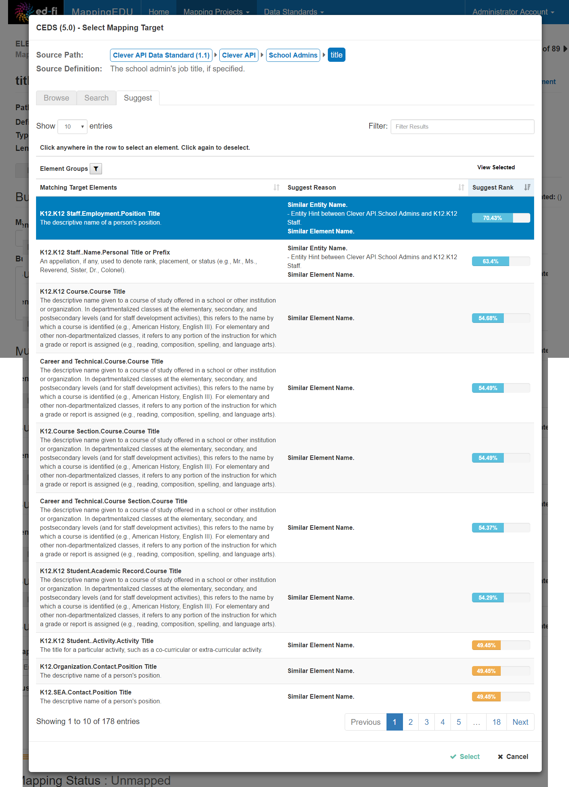
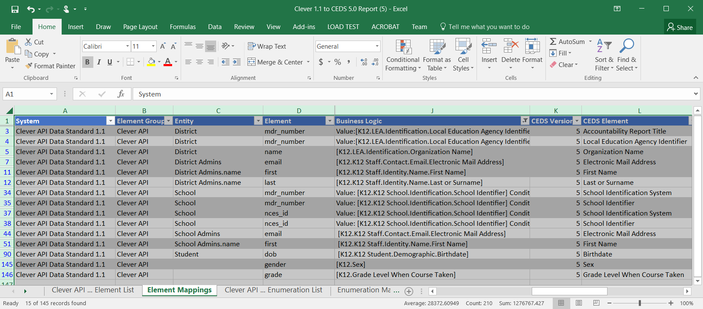

# Getting Started - About MappingEDU

MappingEDU is a web-based system designed to assist users in mapping one data
standard to another.

## What does MappingEDU do?

MappingEDU comes pre-loaded with common data standards including a
version of CEDS and a version of the Ed-Fi Data Standards – and you can
enter your own organization's data standards online. You can set up a
mapping project and enter business logic for how each field or element
in one standard maps to the other.

## How does MappingEDU do that?

Analysts typically use several different tactics to map data standards,
and MappingEDU accordingly allows many approaches. For any given
element, users can directly enter business rules, browse for an element
or elements to target, search and filter through a standard for elements
that most directly map, and so forth. Users can also use the Matchmaker
feature, which automatically applies several different strategies to
find a match.

## What does MappingEDU output?

Most data mapping projects go through a number of reviews. Once
finished, the results are handed off to technology for implementation.
MappingEDU allows for online collaboration to review mappings – but also
makes it easy to get the mapping data out of the system and into the
hands of reviewers and technical staff. The primary output is a Data
Mapping Report that gets output to an Excel file.

The system is simple to use, and just takes a few minutes to learn.
However, it has a number of optional features that can shave hours off
your analysis and review time. Check out the [User Guide](../user-guide) in
this documentation for more information.
