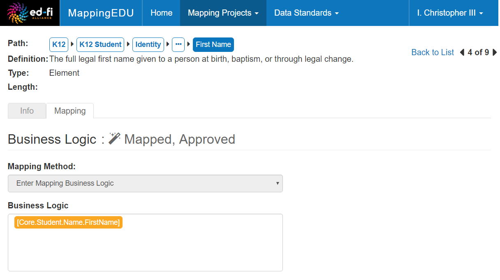
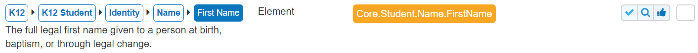
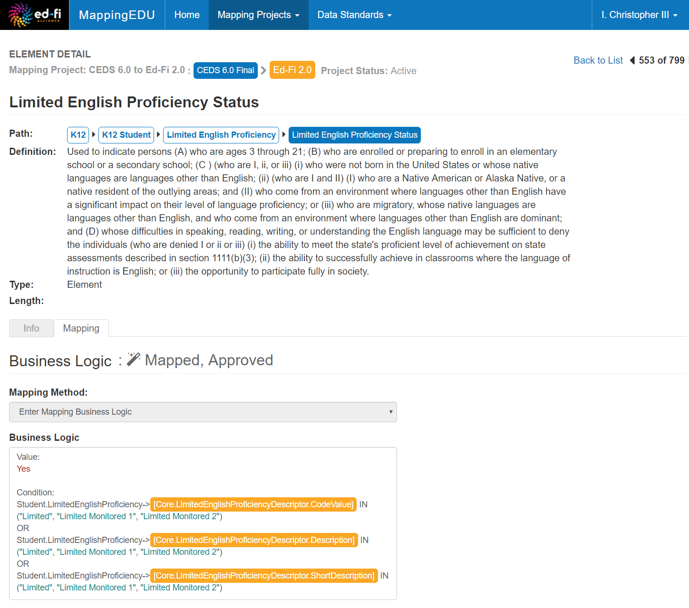
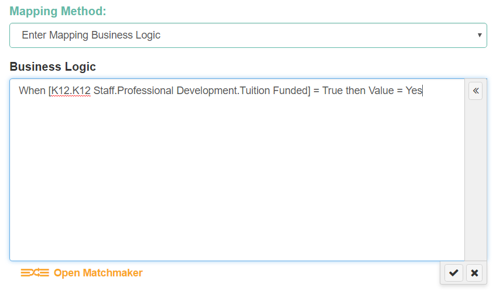
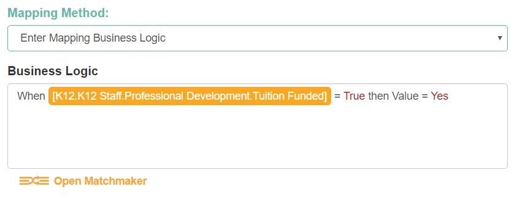
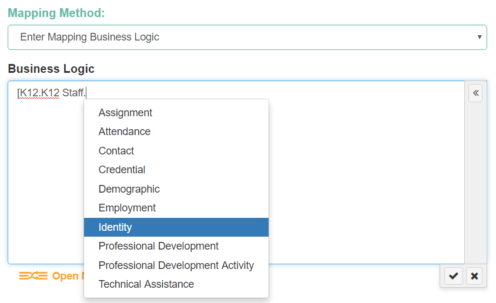
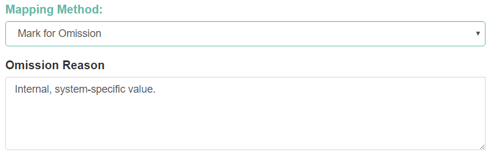
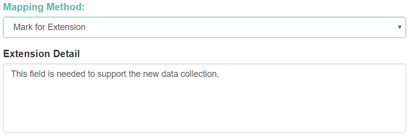

# User Guide - Business Logic

The mappings between elements in two different data standards are
recorded as Business Logic. This section contains conceptual and how-to
information about how the Business Logic field works in MappingEDU.

## What is Business Logic in MappingEDU?

Business Logic is simply an expression describing an element in the
Source Data Standard in terms of the Target Data Standard.

### Simple Mapping Example

In the simple mapping below, the student "FirstName" element in the
Target (in orange in the Business Logic field) is mapped to the
student "First Name" element in the Source (in blue, next to the Path
label near the top of the screen).

The system will often show mappings in a working queue or other list
view. Here's the same mapping shown in a more compact form.

### More Complex Mapping Example

Not all Business Logic is a simple one-to-one match. MappingEDU allows
you to enter more complex mappings, including mappings between multiple
elements, conditionals, etc. The example below shows a slightly more
complex mapping.

### A Few Things of Note

The examples above illustrate a few important points:

* The Business Logic field allows free-form text. You can enter logic,
    equations, or a general description – whatever expresses the mapping
    at the right level of detail and specificity for your purpose. Most
    projects elect to use a pseudocode-like notation that balances
    readability for business users against specificity for developers.
* The Business Logic field automatically applies light syntax
    highlighting. For example, string values are styled in turquoise;
    literal, unquoted values are in a deep red; and elements in the
    Target Standard are highlighted in an orange outline.
* The Target Standard elements are indicated by surrounding text in
    \[square brackets\]. (We cover entry in more detail below.) These
    elements are usually the most important pieces of information in the
    Business Logic, and so are validated against the Target Standard. If
    an element with a matching path and name is not found in the Target
    Standard, the system will warn you and not allow you to save the
    Business Logic until the error is corrected.

## How Does Business Logic Get Entered?

Entering Business Logic is easy: In the Element Detail screen Mapping
tab, click on the Business Logic field and start typing.

As noted elsewhere, the Business Logic field is a free-form text field,
so you can enter any mapping logic that clearly and accurately describes
the mapping to your satisfaction. When you save your work (by clicking
the check-mark button), the system applies any syntax formatting.

In this example, the system highlighted an element from the Target Data
Standard and a few constant values.

You'll notice that the elements from the Target Data Standard is
enclosed in \[square brackets\]. Before applying the highlighting, the
system validates that anything in \[square brackets\] is a valid data
element (along with its full path) in the Target Data Standard.

To assist you in picking a valid element, the system has an
auto-completion feature (similar to Intellisense in programming
environments). Simply type an opening square bracket and start typing a
path in the Target Data Standard. The system will provide you with valid
path and element options.

The list of options is built dynamically from the Target Data Standard
definition – so this will work on pre-loaded standards such as CEDS and
the Ed-Fi Data Standards, but also custom standards that you upload for
your project.

As an alternative to typing a path and element, the system also has a
Matchmaker feature that helps you browse and search the Target Data
Standard. That's covered in the [Matchmaker](Matchmaker.md)
section of this documentation.

## What if There's no Matching Element?

Not all elements in the Source Data Standard will have a valid match in
the Target Data Standard. Rather than just "leave the Business Logic
blank," MappingEDU has a few structured ways of dealing with this common
situation.

### Mark for Omission

If there's a good reason for not finding a logical match in the Target
Data Standard, you can mark an element for "omission" – which simply
acknowledges that there's no match to be found. Under **Mapping
Method**, select **Mark for Omission**.** **You can optionally enter a
reason in the Omission Reason field.

### Mark for Extension

In some cases, you may determine that the Target Data Standard requires
an additional field through customization or extension. You can also
mark a field for "extension." Under Mapping Method, select Mark for
Extension. You can optionally enter reasoning for or details about the
extension.

## User Guide Contents

Read more about how to use MappingEDU:

* [The Basics](The_Basics.md)
* [Data Standards](Data_Standards.md)
* [Mapping Projects](Mapping_Projects.md)
* [Business Logic](Business_Logic.md)
* [Matchmaker](Matchmaker.md)
* [Workflow](Workflow.md)
* [Mapping Review Report](Mapping_Review_Report.md)
* [Mapping Helper](Mapping_Helper.md)
