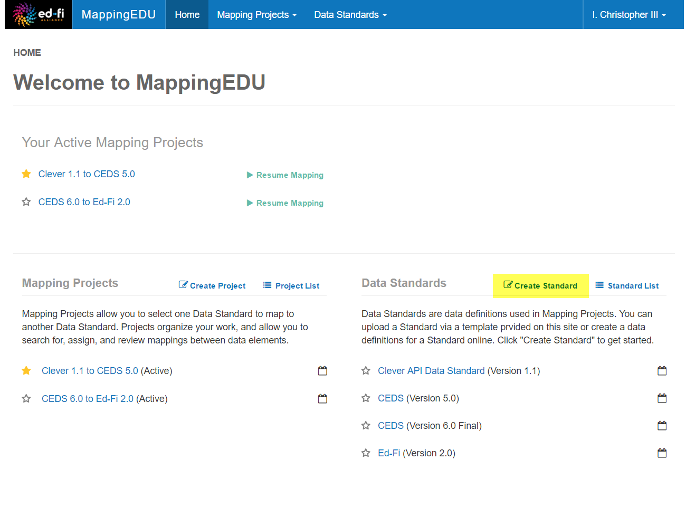
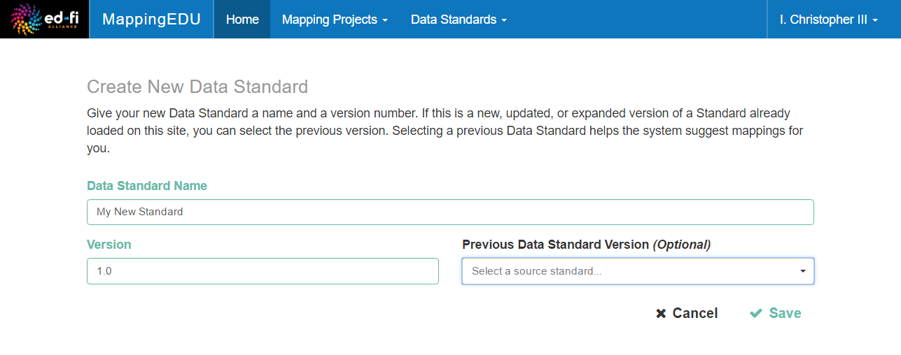
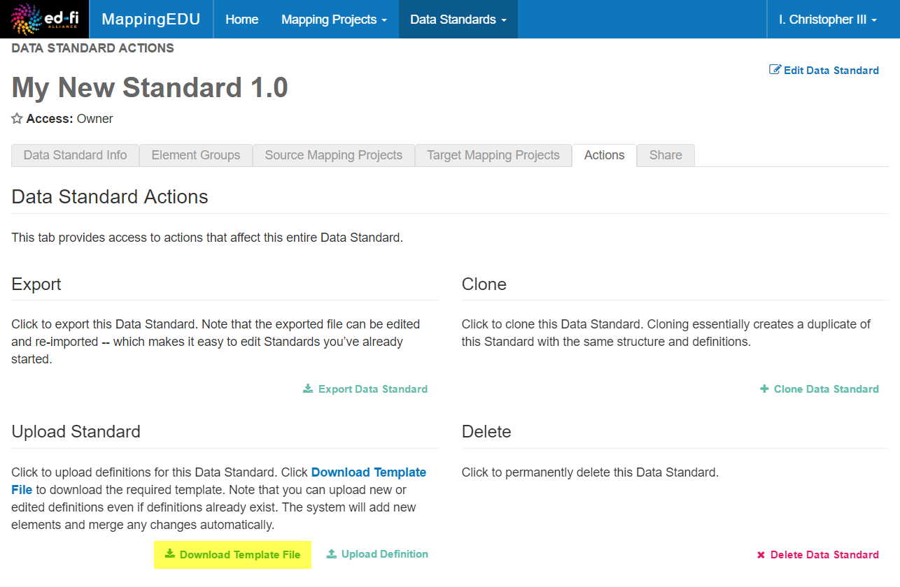
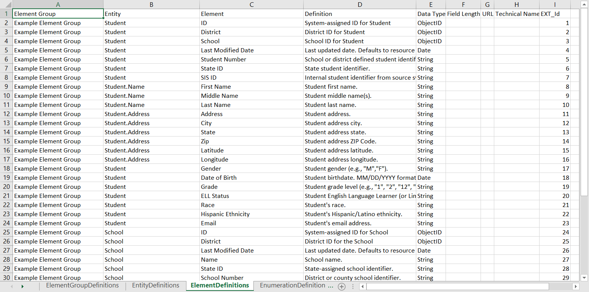
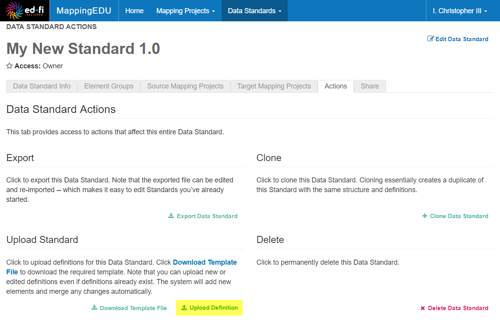
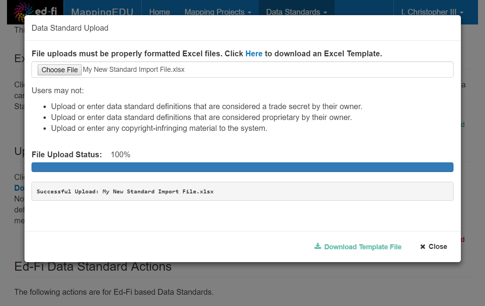

# User Guide - Data Standards

MappingEDU comes pre-loaded with a few common data standard
definitions – but you'll eventually want to map to your own data
standards. This section outlines the conceptual and how-to information
to do that.

## What is a Data Standard in MappingEDU?

A MappingEDU Data Standard is simply a set of elements plus their
organization and definition. Standards are defined in a
specific-but-flexible structure, and can represent a number of technical
and logical standards, including:

* SQL tables and columns
* XSD entities and elements
* CSV data collections
* Data dictionaries
* Web form screens and fields
* ...or practically anything with a name-definition pair

MappingEDU is "aware" of common properties like types, paths, and so
forth, but you're not required to enter that information to get started.
Similarly, MappingEDU allows for the organization of your data standard
into a hierarchical structure – but that hierarchy can represent
whatever makes sense in your context, whether that's something technical
like the entities and complex types that make up your XSD file or
something conceptual like the screens that show the data fields to which
you're mapping.

## How do I get a Data Standard into MappingEDU?

There are essentially two methods for getting a standard into
MappingEDU: you can enter the standard online, or use the provided
template for uploading the data standard. Most users will find the file
upload method faster and easier, so we'll focus on that.

However, it's worth noting that once you upload a standard, you can edit
it online – including adding new elements, tweaking definitions, etc.
Furthermore, you can export the standard back to Excel, edit the Excel
file offline, and re-import the standard.

The high-level steps are as follows:

* Step 1. Click Create Standard
* Step 2. Enter a Name and Version for the Standard.
* Step 3. Download the Data Standard Template from the Actions Tab
* Step 4. Enter your Standard Definitions into the Excel Template
* Step 5. Upload your Completed Template

Detail is provided below.

### Step 1. Click Create Standard

The Create Standard button is available from a few places including the
MappingEDU home page.

### Step 2. Enter a Name and Version for the Standard.

Selecting a Previous Data Standard version is optional, but highly
recommended when your standard is a newer version of a standard
previously loaded.

### Step 3. Download the Data Standard Template from the Actions Tab

Your new MappingEDU Data Standard has an Actions Tab from which you can
download and edit the definitions for your standard.

### Step 4. Enter your Standard Definitions into the Excel Template

The supplied Excel template has example data pre-loaded so you can get a
sense for the structure and definition.

A few items of note:

* You should review and fill out every tab. In the example above, the
    "Example Element Group" in Column A is "defined" in the first
    **ElementGroupDefinitions** tab, and must be present there.
    Similarly, the "Entities" in Column B are defined in the
    **EntityDefinitions** tab and must be present there. If these are
    not present, the system will not import those elements – though you
    will be provided with a friendly error message that can help you
    figure out what went wrong.
* The **Entity** column defines the "path" to the element, and can be
    N levels deep, delimited by a period.
* The **Element** is the actual definition to which you'll be mapping,
    analogous to an element in an XSD, a column in a database, and so
    forth.
* You can add one or more custom fields to your definition by adding
    columns to the template starting at Column I. In this example,
    Column I contains a header labeled "EXT_Id". This field will be
    added to the MappingEDU Data Standard definition, and will appear
    on-screen and in the mapping exports.
* Please note that file uploads are limited to 4 MB. If your template
    is more than 4 MB after it has been filled out, you can break it
    into multiple files to upload it. If breaking the file apart, please
    ensure each file meets the requirements listed above.

### Step 5. Upload your Completed Template

You upload your template from the same screen where you downloaded it:
on the MappingEDU Data Standard Actions tab.

Please remember that file uploads are limited to 4 MB.

Follow the on-screen instructions. Presuming success, you'll see the
success message.

Your new MappingEDU Data Standard is now ready to be used in a Mapping
Project.

## Tips & Tricks

Here are a few helpful hints about working with MappingEDU Data
Standards:

* The data in the supplied template can be imported as-is. If you're
    planning a major import, consider doing a few test runs, adding to,
    removing, and editing elements in the sample file to get a feel for
    how the standards you create in the Excel file are represented
    online.
* The system is fairly tolerant of errors, and provides helpful
    diagnostic information where it can. For the most part, the system
    gracefully handles re-importing files until the definitions are
    structurally correct. However, if you wind up doing several
    re-imports, consider importing your definitions into a fresh, new
    MappingEDU Data Standard.
* If you're having trouble figuring out how to make a particular kind
    of change to your standard definition, consider using the online
    editing features to make minor edits. The system supports round-trip
    editing, meaning that the standard you import can be edited online,
    exported to Excel, modified offline, and re-imported.

## User Guide Contents

Read more about how to use MappingEDU:

* [The Basics](The_Basics.md)
* [Data Standards](Data_Standards.md)
* [Mapping Projects](Mapping_Projects.md)
* [Business Logic](Business_Logic.md)
* [Matchmaker](Matchmaker.md)
* [Workflow](Workflow.md)
* [Mapping Review Report](Mapping_Review_Report.md)
* [Mapping Helper](Mapping_Helper.md)
