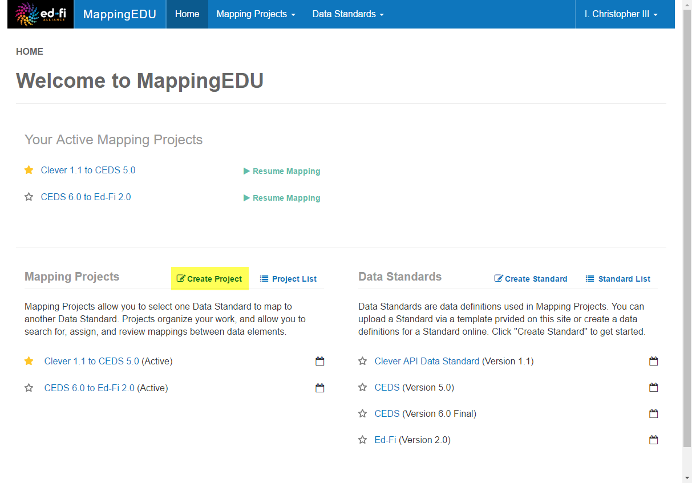

# User Guide - Mapping Projects

MappingEDU organizes work around Mapping Projects. This section outlines
conceptual and how-to information for working with Mapping Projects.

## What is a Mapping Project?

Mapping Projects map one Data Standard (the "Source") to another Data
Standard (the "Target"). Once you set up a Mapping Project, you can
enter the business logic that maps the elements in the Source standard
to the Target standard.

We'll look at MappingEDU [Business Logic](Business_Logic.md)
in the next section, so we'll stay focused on the Mapping Project for
now. Mapping Projects have a few attributes worth knowing about.

### Mapping Projects Have Status

The Mapping Project has an overall status to help you keep your projects
organized. For example, "Active" projects appear at the top of the Home
Page when you log in:

You'll see that Business Logic (i.e., the mapping between elements) has
a [workflow status](Workflow.md) as well. When all your
Business Logic mappings have been "Approved," the system will suggest
that you "Close" your project. Note, however, that you can Close a
Mapping Project any time. Your Mapping Projects are, of course, still
accessible even after you close them. Select **View All Projects** from
the **Mapping Projects** menu.

### Mapping Projects Can Be Shared

When you set up a new Mapping Project, you are its owner – and only you
can see the Project. However, you can give permissions to share the
project with any registered MappingEDU user. You can choose to give
read-only, read-write, or full owner privileges when sharing your
project.

Visit **Project Detail** \> **Sharing** tab to share your projects. As
noted on-screen, sharing your project gives the permissions you assign –
and also provides the users you select with view-only access to the Data
Standards in the project, if they don't already have permissions.

## How do I Create a Mapping Project?

Creating a Mapping Project is easy – but before you start a large
project, make sure that your Data Standard is uploaded and is at least
basically correct. See the [Data Standard](Data_Standards.md)
section for more information. You can make additions and some edits to
your Data Standard even after you start a Mapping Project – but once you
start attaching business logic to mappings, the system won't let you
delete or rename elements you've already used in your mapping.

The high-level steps to create a Mapping Project are as follows:

* Step 1. Click "Create Project
* Step 2. Pick a Source and Target Standard, and Name Your Project
* Step 3. Optionally Try Mapping Helper
* Step 4. Save Your Project and Get Started

Detail is provided below.

### Step 1. Click "Create Project"

The "Create Project" button is available from a few places including the
MappingEDU home page.

### Step 2. Pick a Source and Target Standard, and Name Your Project

You can name your project anything you'd like, but we suggest slipping
the names of the standards in there somewhere. You can also optionally
add a description.

The main task here is to select a Source Data Standard and a Target Data
Standard.

The Source Data Standard will be your working list: the system will
prompt you to find a match – or explicitly mark fields for omission or
extension – until you're finished.

### Step 3. Optionally Try Mapping Helper

The system has a Mapping Helper feature that can suggest some mappings
using the data in the standards. The Mapping Helper can provide a
helpful starting point, but it is not a substitute to the expertise
needed to map most elements.

For more on the Mapping Helper, including how it searches for mappings,
please see [User Guide - Mapping Helper](Mapping_Helper.md)

This step is optional – but it can't hurt: you can review the mappings
before choosing to apply then, and you can always remove or edit the
mappings individually if you'd like.

Select the **Create Project with Mapping Helper **to give it a try.
You'll be given the chance to preview mappings – and can choose to
accept the suggestions or create an empty project instead.

### Step 4. Save Your Project and Get Started

When you've finished the setup steps above, you'll be taken to the
Mapping Project Dashboard for your new project.

Click around and explore the system to get started. A good place to
start is by clicking one of the List buttons.

## Tips & Tricks

Here are a few things worth knowing about Mapping Projects:

* Feel free to experiment, especially when you're just starting.
    There's no penalty for creating a new project – you can always
    delete or close it later. Many users get started with MappingEDU by
    creating a test Mapping Project with two existing Data Standards and
    trying out the mapping features.
* Report anytime. The main output from MappingEDU is the Mapping
    Review Report (accessible from the **Mapping Project** \>
    **Reports** tab). This report contains the mapping logic for the
    entire project. You can output this report at any time, even on a
    brand-new project. Many users find this to be an excellent progress
    report.
* Most mappings between standards are directional. Sometimes, mapping
    business logic is easy, with a single element in one standard
    mapping to a single element in another standard. For example, a
    student first name field in a Source standard may map easily to a
    student first name field in the Target standard. However, anyone
    who's done a large mapping project knows that more often than not
    the logic isn't that simple: fields need to be combined, split,
    averaged, queried, and so forth. This means that if you're doing a
    mapping for a bi-directional information exchange, you'll probably
    want to set up two different projects, with one standard acting as
    the Source in one project and the Target in the other.
* Get the Data Standard definitions correct before you start a major
    project. We've noted this above, but it bears repeating: you really
    should have your Data Standard in good shape before you start a
    large project. This means that the standard should be organized in a
    sensible, technically correct way, the definitions should be
    reviewed, and so forth.

## User Guide Contents

Read more about how to use MappingEDU:

* [The Basics](The_Basics.md)
* [Data Standards](Data_Standards.md)
* [Mapping Projects](Mapping_Projects.md)
* [Business Logic](Business_Logic.md)
* [Matchmaker](Matchmaker.md)
* [Workflow](Workflow.md)
* [Mapping Review Report](Mapping_Review_Report.md)
* [Mapping Helper](Mapping_Helper.md)
