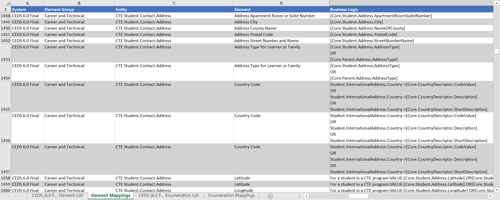
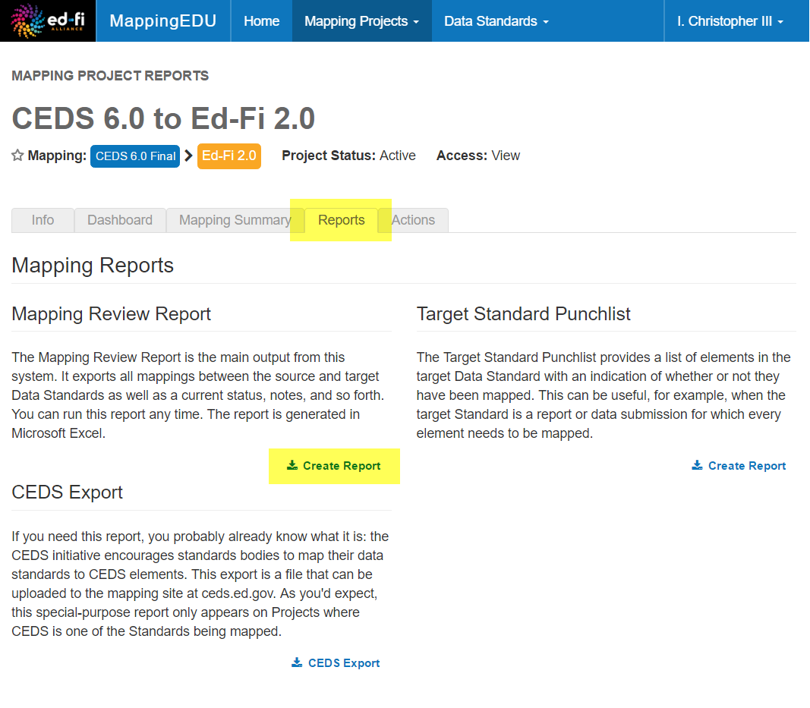
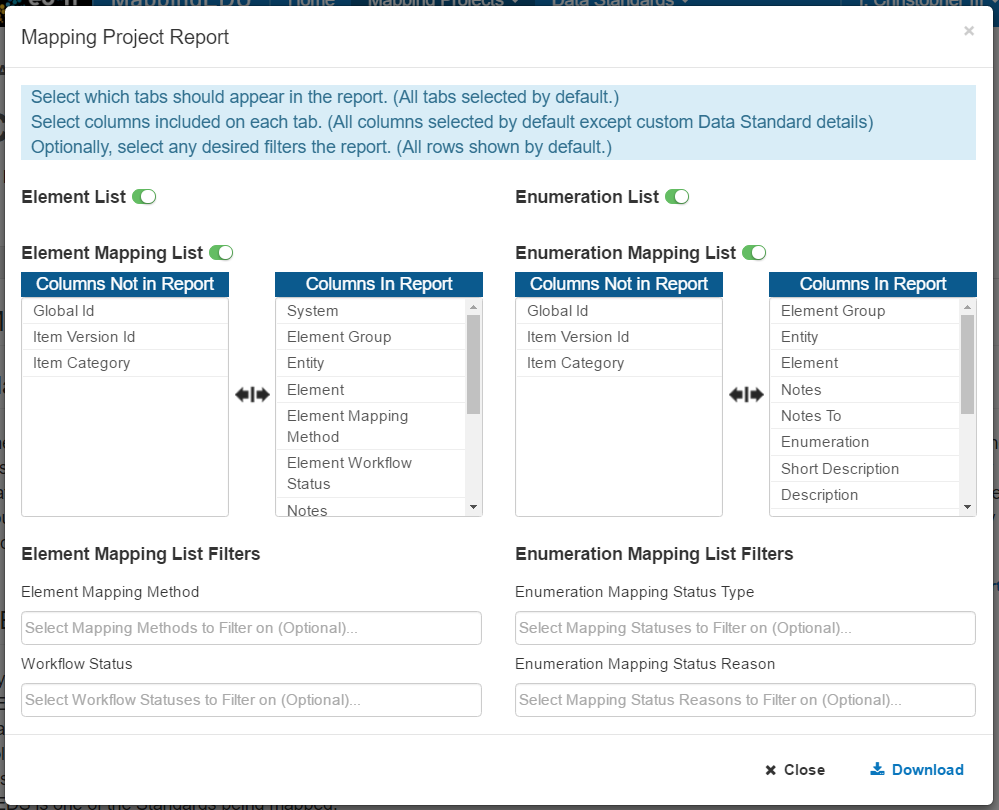

# User Guide - Mapping Review Report

The Mapping Review Report is the main output of MappingEDU. It produces
a document that's easily sharable with others in your organization, and
includes information that allows technologists responsible for
implementing data transfers and ETL to begin their work. This section
contains conceptual and how-to information about the Mapping Review
Report.

## What is the Mapping Review Report?

The Mapping Review Report is an Excel file output from MappingEDU,
showing the mapping business logic between two standards.

The Mapping Review Report contains:

* The definitions for the Source Data Standard (on the Element List
    tab of the report).
* The business logic/element mappings (on the Element Mappings tab).
* The definitions of any enumerations in the system (on the
    Enumeration List tab).
* The business logic/item-level mappings for enumerations (on the
    Enumeration Mappings tab).

## Who is the Audience for the Mapping Review Report?

The primary audience for the Mapping Review Report are technologists,
ETL developers, and system integrators who will actually implement the
data exchange between the mapped systems. The MappingEDU report may look
familiar to those who have previous experience with large-scale mapping
projects: MappingEDU basically outputs a report that many users will
have built by hand directly in Excel.

A secondary audience are SMEs or other reviewers who may not have access
to MappingEDU, or simply prefer to review information in a familiar,
tabular format.

## Do I Need the Mapping Review Report if My Developers Have Access to MappingEDU?

Not necessarily. MappingEDU and its user experience is focused on
building and reviewing data mapping and business logic. You'll want to
consult with your development team on what they feel comfortable working
with – some may find the on-screen view useful, but many will likely
prefer the detailed, at-a-glance view offered by the Mapping Review
Report spreadsheet.

## How Does the Mapping Review Report Get Generated? 

Generating the Mapping Review Report is easy: click on the **Reports**
tab for your project, then click on the **Create Report** button:

The following screen will appear, allowing you to customize your report
in all sorts of ways:

## Tips & Tricks

Here are a few items of note regarding the Mapping Review Report:

* You can output custom Data Standard fields to your report. The
    Mapping Project Report download screen allows you to customize the
    report in a number of ways. The most requested feature is to output
    custom fields in the report – simply select the custom fields from
    the Columns Not in List. (There are so many customization options,
    this may not be immediately apparent.)

* As noted elsewhere, you can output this report any time, even when a
    project is not complete. Many users find the Excel version useful
    for status meetings during a long project lifecycle.

## User Guide Contents

Read more about how to use MappingEDU:

* [The Basics](The_Basics.md)
* [Data Standards](Data_Standards.md)
* [Mapping Projects](Mapping_Projects.md)
* [Business Logic](Business_Logic.md)
* [Matchmaker](Matchmaker.md)
* [Workflow](Workflow.md)
* [Mapping Review Report](Mapping_Review_Report.md)
* [Mapping Helper](Mapping_Helper.md)
