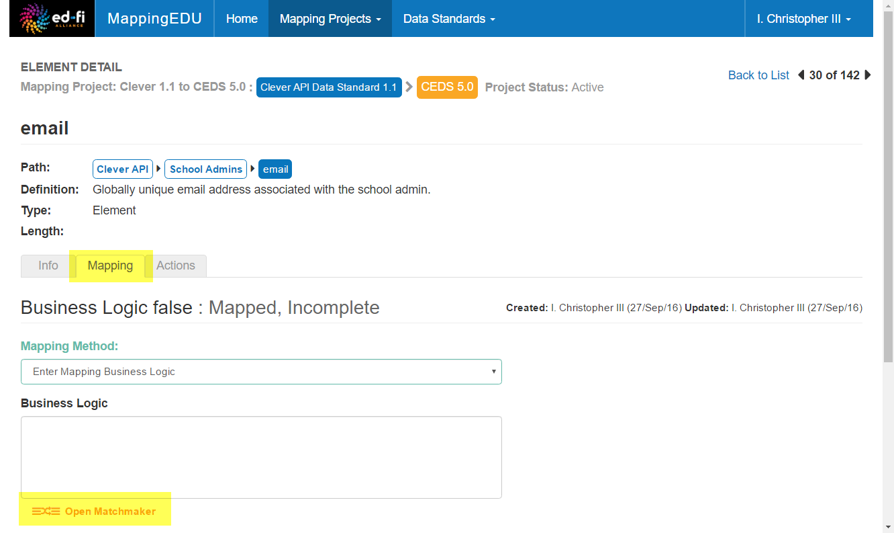
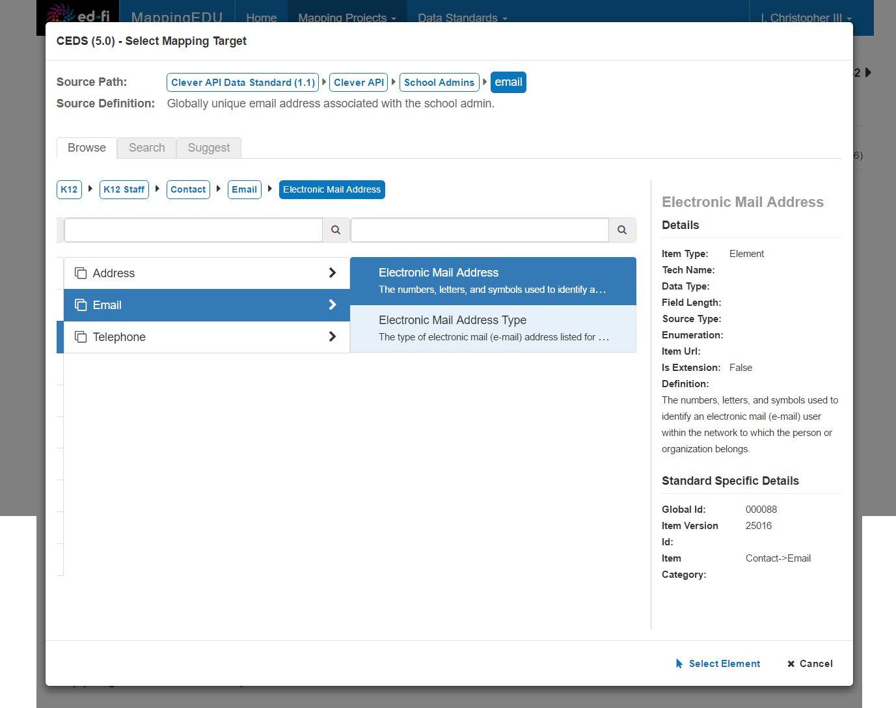
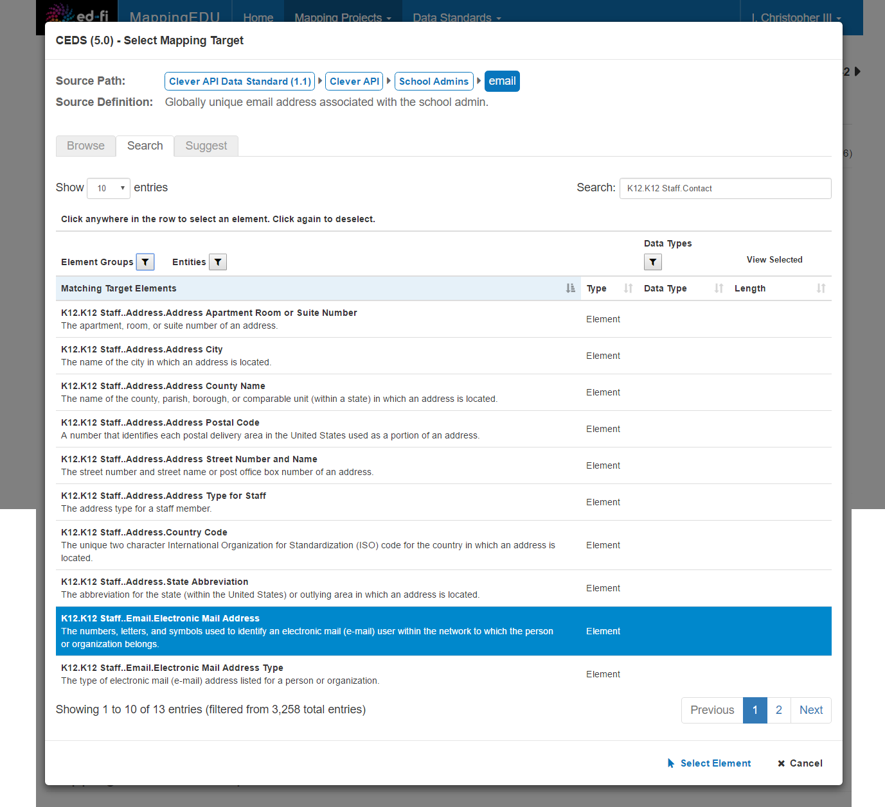
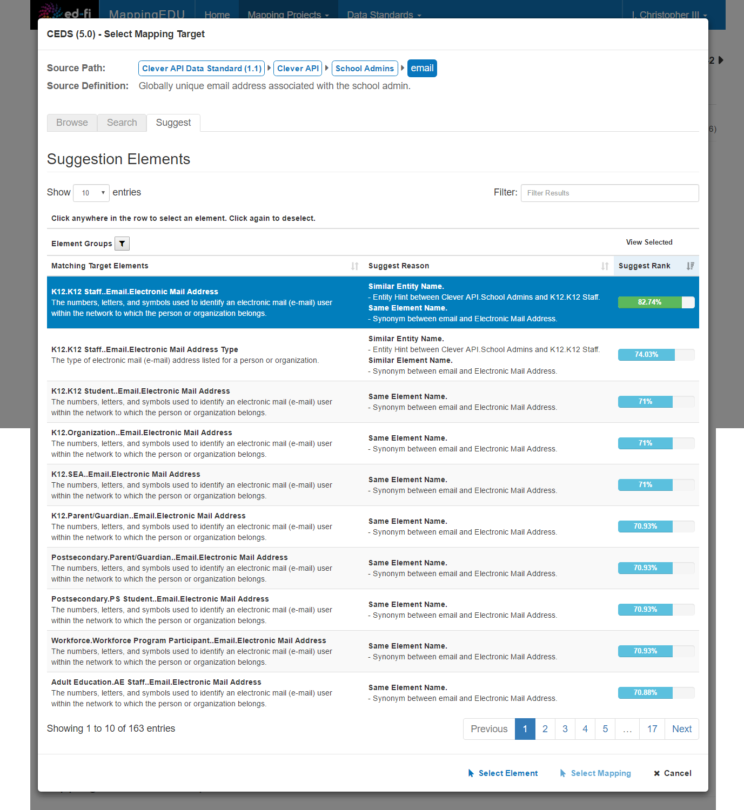
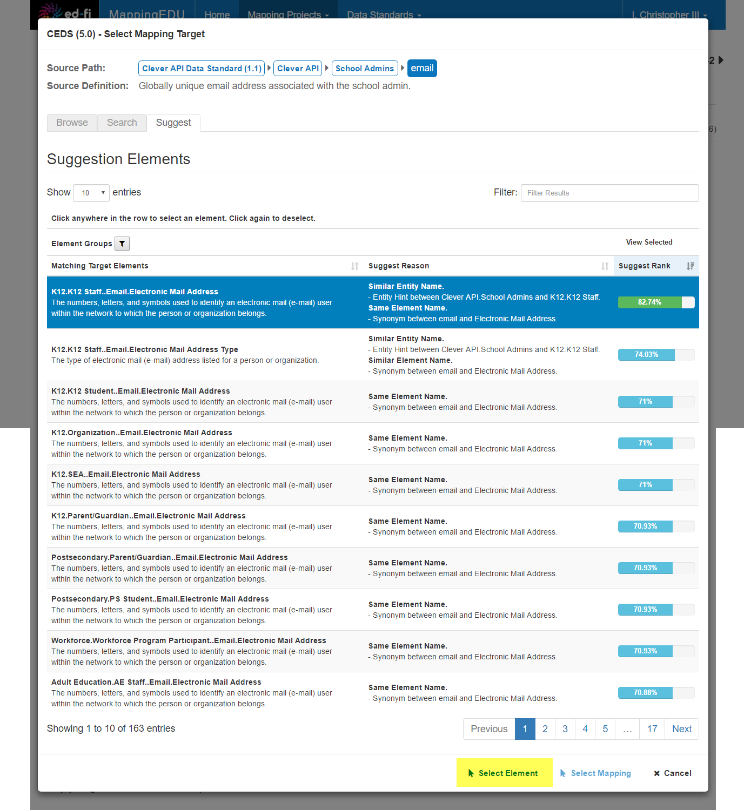

# User Guide - Matchmaker

Mapping Projects sometimes require analysts and technologists to create
mappings between standards with hundreds, or even thousands, of
elements. In addition, one of those standards may be new to the
environment, meaning that finding mappings involves wading through
detailed documentation.

MappingEDU has a feature called Matchmaker designed to help with this
problem. Matchmaker provides ways to browse and search data standards –
and even has a feature that suggests a range of candidate elements for
the user to consider.

This section contains conceptual and how-to information about how the
Matchmaker feature helps users find candidate elements for their
Business Logic.

## How do I Access the Matchmaker?

The Matchmaker is found on the **Element Detail** screen on the
**Mapping** tab. The **Open Matchmaker** button appears under the
Business Logic field.

You can click Open Matchmaker whether or not the Business Logic field is
selected.

## How do I Use the Matchmaker? 

The Matchmaker has three separate modes – all of which simply provide
different ways of viewing and filtering the Target Data Standard to find
matching elements to use in your business logic.

The screen shots below show the three modes, using a simple staff e-mail
address as an example.

### Browse

The Browse feature allows you to navigate the entire Target Data
Standard's structure. This is especially useful for exploring standards
that are new to you or that have cryptic field names. In the screen
capture below, you can see that the match for the Source's **School
Admins.email** field is a few levels deep in the Target Standard's
**K12.K12 Staff.Conact.Email.Electronic Mail Address** element.

The Browse mode allows you to see the technical specifications for the
selected element in a panel on the right of the screen.

### Search

The Matchmaker Search mode allows you to filter the Target Data Standard
by keyword. The keyword search looks through the element name, path,
annotation, and other likely fields. Using the filter criteria above the
Matching Target Element list, you can restrict your search to a specific
part of the Target Standard or to a specific data type.

Most users find this mode useful after they get familiar with the Target
Data Standard.

The example above shows just one selected element, but you can also
select multiple elements.

### Suggest

The Matchmaker Suggest mode uses a variety of strategies to recommend
matching elements or business logic in the Target Data Standard. The
strategies range from common-sense strategies (like matching the
definition, or close matches in the path and element name) to leveraging
data from past mappings (as when a standard has been updated, but
mappings for unchanged elements in the previous version are still
valid).

The Suggest mode shows a list of candidate elements, ranked by the
degree of confidence in the mapping. In the example below, the top
element happens to be the right match, but that won't always be the
case.

Similar to the Search mode, you can select multiple elements, if
applicable, for insertion into the Business Logic field.

## How do I Enter an Element from the Matchmaker?

Once you've found a match, how do you enter it into the Business Logic
field? Easy: simply select the matching element and press the **Select
Element** button under the list.

## Tips & Tricks

The following are additional points of interest about the Matchmaker.

* Suggest can offer full business logic, not just elements. Not all
    business logic is as easy as picking a single element. Sometimes the
    logic is a fairly detailed calculation involving multiple fields. If
    the Matchmaker finds complex business logic in past mapping
    projects, it will include that logic above the list of elements.
    This is particularly useful when updating standards, since many
    previous mappings will still be valid.  
* The Mapping Helper feature uses the Matchmaker engine. When you set
    up a new Mapping Project, you're offered the choice to create it
    with the Mapping Helper. Not surprisingly, the Mapping Helper
    feature uses the same basic engine as the Matchmaker – however, it
    just limits its choices to mappings with a very high probability of
    being correct.

## User Guide Contents

Read more about how to use MappingEDU:

* [The Basics](The_Basics.md)
* [Data Standards](Data_Standards.md)
* [Mapping Projects](Mapping_Projects.md)
* [Business Logic](Business_Logic.md)
* [Matchmaker](Matchmaker.md)
* [Workflow](Workflow.md)
* [Mapping Review Report](Mapping_Review_Report.md)
* [Mapping Helper](Mapping_Helper.md)
