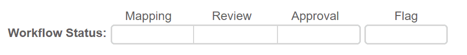
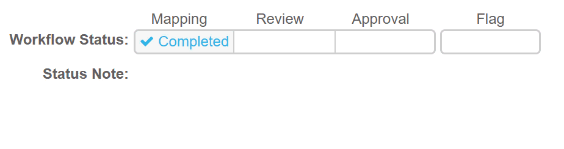

# User Guide - Workflow

MappingEDU includes support for a flexible, lightweight workflow. This
section describes the essential features.

## Workflow is Useful, but Optional

We'll say up front – the workflow features are totally optional. You can
complete an entire mapping project and output the Mapping Project Report
while totally ignoring the workflow features.

## Workflow is Flexible

The workflow represents common data standard review steps, but you and
your team of co-workers and reviewers can assign specific meaning to
each workflow step, skip steps that aren't meaningful, and so on.
MappingEDU provides the interface to easily set statuses and filter
mappings by status (and other factors) – the semantics and implied
actions of each status are entirely up to you.

## The Workflow Structure

MappingEDU workflow has two parts: a status and a flag.

### Workflow Status

The MappingEDU workflow has three separate workflow steps, each with its
own state:

1. **Mapping.** This can be Completed or Not Completed. A status of
    Completed indicates that the person entering the business logic
    believes that the logic is accurate and logically complete.
2. **Review.** This can be Reviewed or Not Reviewed. A status of
    Reviewed indicates that the business logic has been checked. In
    enterprise mapping projects, this step is often done by a subject
    matter expert or an independent business analyst. In smaller
    projects, this may simply mean that the person entering the business
    logic has checked their work.
3. **Approval.** This can be Approved or Not Approved. A status of
    Approved indicates that the project owner has signed off on the
    business logic. In enterprise mapping projects, this can be the
    business owner or program lead. In smaller projects, this may be the
    technical manager for the project.

The statuses are conceptually sequential, but you can move back and
forth in the status or skip steps that aren't meaningful in your
workflow.

### Workflow Flag

The workflow also allows you to "flag" items for attention. The flag is
a simple toggle that can be set on or off in any workflow status. In
addition to being useful as a personal reminder for mappers, the flag is
useful when collaborating with others.

For example, you can use combinations of mapping status and the flag to
build lists for SMEs or other reviewers (e.g., "I need you to take a
close look at every Flagged, Completed mapping"). The Mapping Project
Queue allows your colleagues to filter by any combination of status and
flag.

The system also allows you to write status notes. Similar to the flag,
you can use the note as a personal reminder or a note to others.

## User Guide Contents

Read more about how to use MappingEDU:

* [The Basics](The_Basics.md)
* [Data Standards](Data_Standards.md)
* [Mapping Projects](Mapping_Projects.md)
* [Business Logic](Business_Logic.md)
* [Matchmaker](Matchmaker.md)
* [Workflow](Workflow.md)
* [Mapping Review Report](Mapping_Review_Report.md)
* [Mapping Helper](Mapping_Helper.md)
